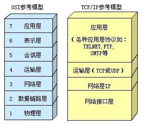
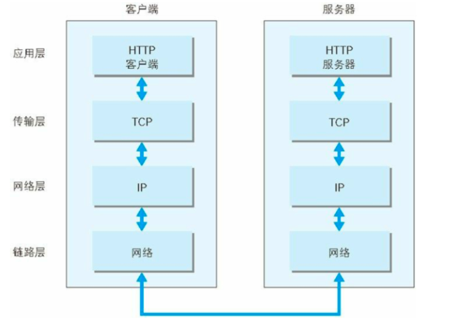
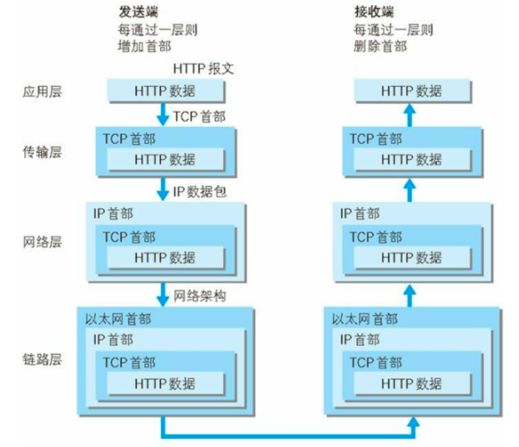
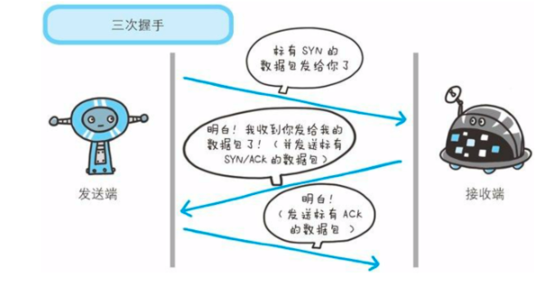
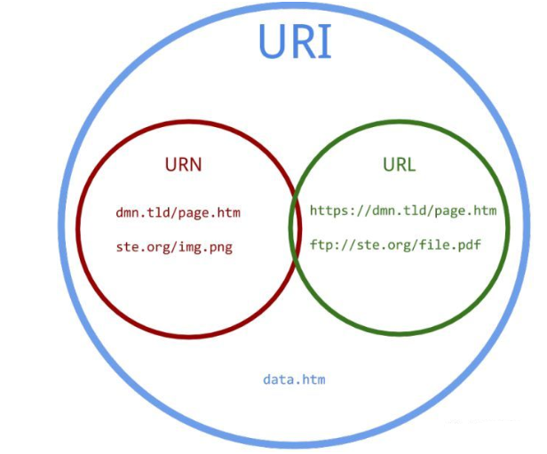
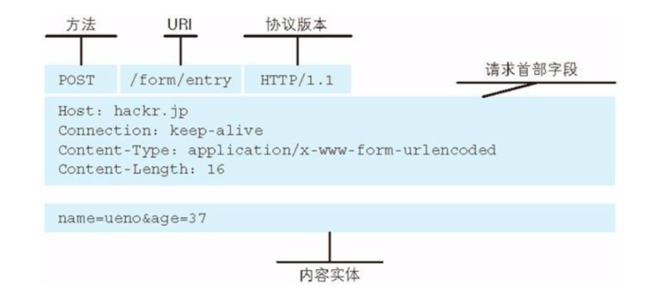
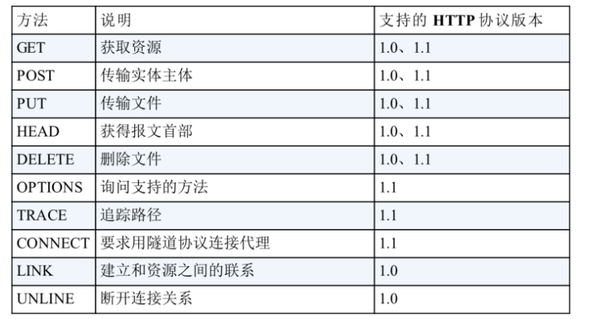
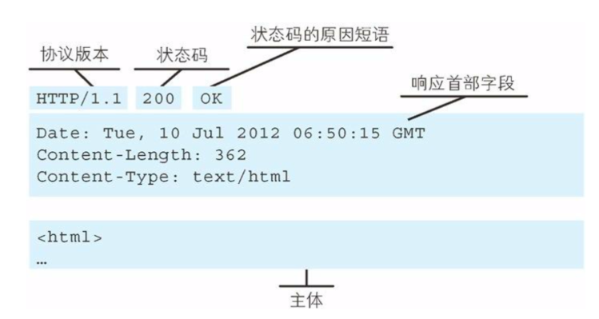

# HTTP协议详解
# 一、简介
HTTP协议是Hyper Text Transfer Protocol（超文本传输协议）的缩写,是用于从万维网（WWW:World Wide Web ）服务器传输超文本到本地浏览器的传送协议。

HTTP是一个基于TCP/IP通信协议来传递数据（HTML 文件, 图片文件, 查询结果等）。

HTTP是一个属于应用层的面向对象的协议，由于其简捷、快速的方式，适用于分布式超媒体信息系统。它于1990年提出，经过几年的使用与发展，得到不断地完善和扩展。目前在WWW中使用的是HTTP/1.0的第六版，HTTP/1.1的规范化工作正在进行之中，而且HTTP-NG(Next Generation of HTTP)的建议已经提出。

HTTP协议工作于客户端-服务端架构为上。浏览器作为HTTP客户端通过URL向HTTP服务端即WEB服务器发送所有请求。Web服务器根据接收到的请求后，向客户端发送响应信息。

# 二、网络基础TCP/IP协议

* TCP/IP的分层管理
  * 应用层 应用层决定了向用户提供应用服务时通信的活动；FTP,DNS,HTTP等均处于此层
  * 传输层 在传输层有两个性质不同的协议：TCP(Transmission Control Protocol 传输控制协议)、UDP(User Data Protocol 用户数据报文协议)
  * 网络层 网络层来处理在网络上流动的数据包；数据包是网络传输的最小数据单位；该层规定了通过怎样的路径到达对方的计算机，并把数据包传输给对方
  * 链路层 用来处理连接网络的硬件部分。

  <div align="center"></div><br>
  
* TCP/IP通信传输流

  


  * 发送端从应用层往下走，接收端从链路层往上走



发送端在层与层之间传输数据时，每经过一层时必定会被打上一个该层所属的首部信息；反之接收端在层与层之间传输数据时，每经过一层时会把对应层的首部信息去掉。


* TCP/IP协议的可靠性

TCP协议采用三次握手的策略保证传输的可靠性，握手过程中使用了TCP的标志，SYN(synchronize)和ACK(acknowledgement)

发送端首先发送一个带SYN标志的数据包给对方；接收端接收到后，回传一个带有SYN/ACK标志的数据包表示确认信息；最后，发送端再回传一个带ACK标志的数据包，代表握手结束


TCP四次挥手

所谓四次挥手（Four-Way Wavehand）即终止TCP连接，就是指断开一个TCP连接时，需要客户端和服务端总共发送4个包以确认连接的断开。在socket编程中，这一过程由客户端或服务端任一方执行close来触发，整个流程如下图所示：


参考：https://www.cnblogs.com/buxiangxin/p/8336022.html

* URI和URL

很多人会混淆这两个名词。

URL：(Uniform/Universal Resource Locator 的缩写，统一资源定位符)。

URI：(Uniform Resource Identifier 的缩写，统一资源标识符)（代表一种标准）。

关系：

URI 属于 URL 更高层次的抽象，一种字符串文本标准。

就是说，URI 属于父类，而 URL 属于 URI 的子类。URL 是 URI 的一个子集。

二者的区别在于，URI 表示请求服务器的路径，定义这么一个资源。而 URL 同时说明要如何访问这个资源（http://）。


# 请求与相应

- 持久连接

    HTTP协议的初始版本中，每进行一次HTTP通信就要断开一次TCP连接，在HTTP/1.1和一部分的HTTP/1.0中提出了持久连接(HTTP Presistent Connections,也称为HTTP keep-alive或者HTTP connection reuse)。

    持久连接的特点是：只要任意一端没有明确提出断开连接，则保持TCP连接状态，减少了TCP连接重复建立和断开所造成的额外开销，减轻服务器的负载。


     线化

    以前发送请求后需要等待接并接收到响应后，才能发送另一个请求，管线化技术出现后，不用等待响应也可以直接发送另一个请求，做到了同时并行发送多个请求。

- 请求

    HTTP请求是由请求行、请求头、请求体组成。

    <div align="center"></div><br>

    * 请求行

        请求行是由方法、URI、协议版本组成。

        请求方法有一下几个常用的

        * GET 获取资源
        * POST 传输实体主体，多用于表单提交
        * PUT 保存操作
        * HEAD 获得报文首部
        * DELETE 删除
        * OPTIONS 询问支持的方法
        * TRACE 追踪路径
        * CONNECT 要求用隧道协议连接代理

        <div align="center"></div><br>

    * 请求头

        * Accept 
         
            通知服务器用户代理能够处理的媒体类型及媒体类型的相对优先级，使用type/subtype的形式，一次可以指定多种媒体类型。

            可以使用q=来额外表示媒体类型的优先级，用分号分开，范围在0-1之间，默认为1.0。

            ```
            Accept: text/html,application/xhtml+xml;q=0.1
            ```
            
    * 请求体
   
- 响应

    HTTP响应是由响应行、响应头、响应主体组成

    <div align="center"></div><br>

    * 响应行

        响应行是由协议版本、状态码、状态码的原因短语组成

        常见的状态有一下几个：

        * 1XX 信息性状态码 接受的请求正在处理
        * 2XX 成功状态码 请求正常处理完成

            - 200 OK 客户端发来的请求被服务器端正常处理完成
            - 204 No Content 服务器接受的请求以处理成功，但返回的响应报文中不包含实体的主体部分，也不允许返回任何实体的主体
            - 206 Partial Content 客户端进行了范围请求，而服务器成功执行了这部分的Get请求，响应报文中含有Content-Range指定范围的实体内容 

        * 3XX 重定向状态码 需要进行附加操作以完成请求

            - 301 Moved Permanently 永久重定向，请求的资源已经被分配了新的URI，以后应该使用资源现在所指的URI
            - 302 Found 临时重定向，请求的资源已经被分配了新的URI，希望用户本次能使用新的URI访问
            - 303 See Other 请求对应的资源存在着另一个URI，应使用GET方法定向获取请求的资源
            - 304 Nor Modified 服务器允许请求访问资源，但未满足条件的情况下，304状态码返回时，不包含任何响应的主体部分，304虽然被划分到了3XX中，但是和重定向没有任何关系

        * 4XX 客户端错误状态码 服务器无法处理请求

            - 400 Bad Request 请求报文中含有语法错误，需要修改请求内容后再次发送
            - 401 Unauthorized 发送的请求需要通过HTTP认证，另外若之前进行过一次请求，则表示用户认证失败
            - 403 Forbidden 请求的资源被服务器拒绝了，服务器端没必要给出拒绝详细的理由
            - 404 Not Found

        * 5XX 服务器端错误状态码 服务器处理请求出错

            - 500 Internal Server Error 服务器内部错误
            - 503 Service Unavailable 服务器暂时不可用

