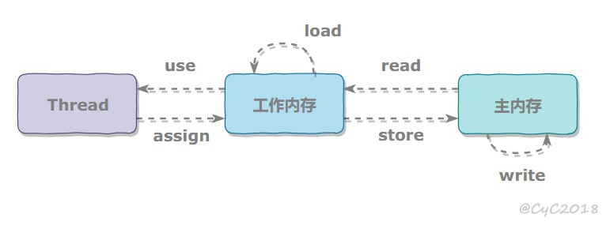

# 一、概述

- **并发和并行**
    并发偏重于多个任务交替执行，而多个任务之间可能还是串行的；并行是真正意义上的“同时执行”。

    使用单核CPU时，操作系统会不停的切换多个任务，多线程之间就是并发；在多核CPU和多CPU中会出现并行

- **进程与线程**
    进程是操作系统进行资源分配和调度的基本单位，是操作系统的基础，进程中可以容纳若干个线程；线程是轻量级的进程，是程序执行的最小单位；使用多线程而不是多进程进行并发程序设计，是因为线程间的切换和调度的成本远远小于进程。

# 二、线程状态的转化

- **线程状态转化图解及代码**

    <div align="center"></div><br>

    ``` java
    // 线程所有的状态都在Thread类中的枚举类State中定义
    // 注意：从new状态出发，线程不能回到new状态；
    // 处于terminated状态的线程也无法回到runnable状态中。
    public enum State {
        NEW,
        RUNNABLE,
        BLOCKED,
        WAITING,
        TIMED_WAITING,
        TERMINATED;
    }
    ```

    *  **新建(new)** 
        创建后尚未运行

    * **可运行(Runnable)**
        可能正在运行，也可能正在等待CPU时间片

        包含操作系统线程状态中的Running和Ready

    * **阻塞(Blocked)**
        等待获取一个排它锁，如果其线程释放了锁就会结束此状态

    * **无限期等待(Wating)**
        等待其他线程显式地唤醒，否则不会被CPU分配时间片

        没有设置时间参数的Object.wait()方法：Object.notify()和Object.notifyAll()退出.

        没有设置时间参数的Thread.join()方法：被调用的线程执行完毕

        LockSupport.park()方法

    * **期限等待(Timed Waiting)**
        无需等该其他线程显式地唤醒，在一段时间后会被系统自动唤醒

        Thread.spleep(timeout) : 时间结束后退出

        Object.wait(timeout) : 时间结束，Object.notify(),Object.notifyAll()退出

        Thread.join(timeout) : 时间结束，被调用的线程执行完毕后退出

        LockSupport.parkNanos()方法

        LockSupport.parkUntil()方法

    * **终止结束(TERMINATED)**
        线程结束任务之后自己结束；产生异常结束

# 三、使用线程

- **实现Runable接口**
    实现run方法，然后通过Thread调用start()方法来启动线程
    ``` java
    public class Worker implements Runnable{
        @Override
        public void run(){

        }
    }
    Worker worker = new Worker();
    Thread thread = new Thread(worker);
    thread.start();
    ```

- **实现Callable接口**
    和Runnable相比，Callable接口是有返回值的，返回值通过FutureTask进行封装。
    ``` java
    public class Worker implements Callable<String> {
        @Override
        public String call(){
            return "finished!";
        }
    }
    Worker worker = new Worker();
    FutureTask<String> task = new FutureTask(worker);
    Thread thread = new Thread(task);
    thread.start();
    //阻塞线程，直到返回结果
    task.get(); 
    ```

- **继承Thread类**
    ``` java
    class MyThread extend Thread{
        @Override
        public void run(){

        }
    }
    ```
- **实现接口VS继承Thread**
    * java不支持多继承，因此继承Thread就无法继承其他的类，不利于扩展，但是可以实现多个接口

    * 类可能只要求可执行就行，继承Thread开销过大

# 三、互斥同步

- **synchronized**
    
    - 根据synchronized作用范围分为对象锁和类锁

    - 同步代码块
        ``` java
        public void func(){
            synchronized(this) {
                .....
            }
        }
        ```
        上面的代码synchronized只作用同一个对象，如果调用两个对象上的同步代码块，就不会进行同步
        ``` java
        public void func(){
            synchronized(Object.class){
                ....
            }
        } 
        ```
        上面的代码synchronized作用在类上，也就是说多个线程调用同一个类的不用对象的同步语句，是可以实现同步的

    - 同步一个实例方法
        ``` java 
        public synchronized void func(){

        }
        ```
        因为是作用在实例方法上，所以两个不同的对象调用此方法，并不能实现同步

    - 同步一个静态方法
        ``` java
        public synchronized static void func(){

        }
        ```
        作用于整个类

- **ReentrantLock**
    - Reentrant是JUC包中提供的锁，JDK实现

- **比较**
    - 锁的实现

        synchronized是JVM的实现，ReentrantLock是JDK的实现

    - 性能

        新版本Java对synchronized进行了很多优化，例如自旋锁等，synchronized和ReentrantLock大致相同

    - 等待中断

        当持有锁的线程长时间不释放锁的时候，正在等待的线程可以放弃等待，改为处理其他的事情

        ReentrantLock可以中断，synchronized不可以

    - 公平锁

        公平锁指的是指多个线程等待锁的时候，必须按照申请锁的时间顺序依次获得锁

        synchronized是不公平的，ReentrantLock默认下是不公平的，但是也可以是公平的
        ``` java
        // Reentrant有参构造函数，true为公平锁，false为不公平锁
        public ReentrantLock(boolean fair) {
            sync = fair ? new FairSync() : new NonfairSync();
        }
        ```

    - 锁绑定多个条件

        一个ReentrantLock可以同时绑定多个Condition对象

# 四、线程之间的协作

- **join()**
    在线程中调用另一个线程的join方法，会将当前线程挂起，而不是忙等待，直到目标线程结束

- **wait(),notify(),notifyAll()**

    它们属于Object的一部分，不属于Thread

    一个线程调用object.wait()方法，那么这个线程就会进入object对象的等待队列,同时该线程会释放锁，当调用object.notify()方法时，它会从等待队列中随机选择一个线程，并将其唤醒；而notifyAll()方法则会唤醒等待队列中所有的线程.

    他们必须包含在synchronized语句中，因为无论是wait方法还是notify方法都需要首先获得目标对象的的一个监视器

    只能在同步方法和同步代码块中使用，否则会在运行时抛出IllegalMonitorStatusException

    wait()会释放锁，sleep()不会释放锁

- **await(),signal(),signalAll()**
    J.U.C提供了Condition类来实现线程之前的协调，可以在Condition上调用await方法使线程等待，其他的线程吊桶signal或者signalAll来唤醒等待的线程

    相比于上面的wait-notify,await可以指定等待条件，因此更加灵活

# 五、J.U.C-CAS,AQS
- **CAS**
    - CAS-Compare And Swap 比较交换，核心算法如下：

        执行函数：CAS(V, E, N)

        包含三个参数：
        - V 要更新的变量
        - E 预期值
        - N 新值

        原理图如下：
        
        <div align="center"></div><br>

    - UnSafe类里面的CAS相关操作
        ``` java
        //第一个参数o为给定对象，offset为对象内存的偏移量，通过这个偏移量迅速定位字段并设置或获取该字段的值，
        //expected表示期望值，x表示要设置的值，下面3个方法都通过CAS原子指令执行操作。
        public final native boolean compareAndSwapObject(Object o, long offset,Object expected, Object x);                                                                                                  
        public final native boolean compareAndSwapInt(Object o, long offset,int expected,int x);

        public final native boolean compareAndSwapLong(Object o, long offset,long expected,long x);
        ```
- **AQS**
    AQS-AbstractQueuedSynchronized-抽象的队列式的同步器

    AQS定义了一套多线程访问资源的同步器框架，许多同步类的实现都依赖于它，例如ReentrantLock、Semaphore、CounDownLatch等

    <div align="center"></div><br>

- **CountDownLatch**
    用来控制一个线程等待多个线程完成

    内部维护一个计数器，每次调用countDown()方法会让计数器减1，减到0时，那些因为调用await()方法的线程就会被唤醒

    ``` java
    final int threadCount = 10;
    CountDownLatch countDownLatch = new CountDownLatch(threadCount);
    ExecutorService executorService = Executors.newCachedThreadPool();
    for (int i = 0; i < threadCount; i++) {
        executorService.submit(() -> {
            System.out.println("Running...");
            countDownLatch.countDown();
        });
    }
    countDownLatch.await();
    System.out.println("End");
    executorService.shutdown(); 
    ```

- **CyclicBarrier**
    用来控制多个线程互相等待，只有多个线程都到达时，这些线程才会继续执行

    CyclicBarrier和CountDownLatch的区别是：

    - CyclicBarrier的计数器通过调用reset方法可以循环使用，所以它叫做循环屏障

    CyclicBarrier有两个构造函数，其中的parties指示计数器的初始值，barrierAction在所有线程到达屏障的时候执行一次

    ``` java
    public CyclicBarrier(int parties, Runnable barrierAction) {
        if (parties <= 0) throw new IllegalArgumentException();
        this.parties = parties;
        this.count = parties;
        this.barrierCommand = barrierAction;
    }   

    public CyclicBarrier(int parties) {
        this(parties, null);
    }
    ```

    ``` java
    final int threadCount = 10;
    CyclicBarrier cyclicBarrier = new CyclicBarrier(threadCount);
    ExecutorService executorService = Executors.newCachedThreadPool();
    for (int i = 0; i < threadCount; i++) {
        executorService.submit(() -> {
        System.out.println(Thread.currentThread().getName() + " is running");
        try {
            Thread.sleep(1000);
            cyclicBarrier.await();
        }
        catch (Exception e) {
            e.printStackTrace();
        }
        System.out.println(Thread.currentThread().getName() + " finished");
            });
    }
    executorService.shutdown();
    ```

- **Semaphore**
    Semaphore类似于操作系统中的信号量，可以控制对互斥资源的访问的线程数

    下面的代码模拟了对于某服务器的并发请求，每次只能有三个客户端同时访问，请求总数为10

    ``` java
    final int clientCount = 3;
    final int requestCount = 10;
    Semaphore semaphore = new Semaphore(clientCount);
    ExecutorService service = Executors.newCachedThreadPool();
    for (int i = 0; i < requestCount; i++) {
        service.submit(() -> {
            try {
                semaphore.acquire();
                //返回此信号量中可用的当前许可数
                System.out.println("当前许可数:" + semaphore.availablePermits());
            }
            catch (InterruptedException e) {
                e.printStackTrace();
            }
            finally {
                semaphore.release();
            }
        });
    }
    service.shutdown();
    ```
- **FutureTask**
    FutureTask实现了RunnableFuture接口，RunnableFuture接口继承了Future和Runnable接口，所以FutureTask既可以作为一个任务执行，也可以返回结果

    ``` java
    public class FutureTask<V> implements RunnableFuture<V>
    ```

    ``` java
    public interface RunnableFuture<V> extends Runnable, Future<V>
    ```

    FutureTask可以用于异步获取执行结果或取消执行任务的场景
    ``` java
    FutureTask<Integer> futureTask = new FutureTask<>(() -> {
        int result = 0;
        for (int i = 0; i < 100; i++) {
            Thread.sleep(100);
            result += i;
        }
        return result;
    });

    new Thread(futureTask).start();

    new Thread(() -> {
        System.out.println("Main task is running!");
        try {
            Thread.sleep(5 * 1000);
        }
        catch (InterruptedException e) {
            e.printStackTrace();
        }
    }).start();

    System.out.println(futureTask.get());
    ```

- **BlockingQueue**
    类型：
    - FIFO队列：LinkedBlokingQueue、ArrayBlockingQueue(固定长度)
    - 优先级队列：PriorityBlockingQueue

    使用take()和put()方法阻塞队列
    - 队列为空时take()方法阻塞队列
    - 队列满员时put()方法阻塞队列

- **ForkJoin**
    主要用于并行计算，把大的计算任务拆分成多个小人物并行计算

# 六、Java内存模型
- **主内存和工作内存**
    处理器寄存器的读写速度比内存快几个数量级，为了解决这种速度的矛盾，在他们之间加入了告诉缓存

    <div align="center"></div><br>

    所有的变量都储存在主内存中，每个线程都有自己的工作内存，彼此之间不可见，并且存储在高速缓存区或者是寄存器中，保存了线程使用的变量主内存副本拷贝

    每个线程只能直接操作工作内存中的变量，不同线程之间的变量传递只能通过主内存来完成

- **内存间交互操作**
    java内存模型定义了8个操作来完成内存和工作内存的交互操作

    <div align="center"></div><br>

    - read：把一个变量的值从主内存中传输到工作内存中
    - load：在read之后执行，把read读取的值存放在工作内存的变量副本中
    - use：把工作内存中的一个变量的值传递给执行引擎
    - assign：把一个从工作引擎接收到的值赋给工作内存的变量
    - store：把一个工作内存中的变量的值传输到主内存中
    - write：在store之后,把store的值放入到主内存中
    - lock：作用主内存的变量
    - unlock

- **内存模型的三大特性**
    - 原子性
        Java内存模型保证了read,load,use,assign,store,write,lock,unlock具有原子性，例如对于一个int类型的变量执行assign组织操作，这个操作是原子性的；但是Java内存模型允许虚拟机没有被volatile修饰的64位数据(long,double)的读写分为两次32位的操作进行，即load,store,read,write操作可以不具备原子性

         <div align="center"></div><br>

         上图演示了两个线程同时对 cnt 进行操作，load、assign、store 这一系列操作整体上看不具备原子性，那么在 T1 修改 cnt 并且还没有将修改后的值写入主内存，T2 依然可以读入旧值。可以看出，这两个线程虽然执行了两次自增运算，但是主内存中 cnt 的值最后为 1 而不是 2。**因此对 int 类型读写操作满足原子性只是说明 load、assign、store 这些单个操作具备原子性。**

        - 使用原子类操作来保证操作的原子性，底层实现是CAS操作
        - 使用互斥锁synchronized来保证原子性操作

    - 可见性
        可见性是指一个线程修改了共享变量，其他的线程能够立即得知这个修改。

        Java内存模型通过在变量修改后将新值同步回主内存中，在变量读取前从主内存刷新变量来实现可见性

        - volatile
        - synchronized:对一个变量执行unlock之前，必须把变量同步回主内存中
        - final:被 final 关键字修饰的字段在构造器中一旦初始化完成，并且没有发生 **this 逃逸**（其它线程通过 this 引用访问到初始化了一半的对象），那么其它线程就能看见 final 字段的值

        对前面的线程不安全示例中的 cnt 变量使用 volatile 修饰，不能解决线程不安全问题，因为 volatile 并不能保证操作的原子性。    

    - 有序性
        在本线程内观察，所有操作都是有序的。在一个线程观察另一个线程，所有操作都是无序的，无序是因为发生了指令重排序。在 Java 内存模型中，允许编译器和处理器对指令进行重排序，重排序过程不会影响到单线程程序的执行，却会影响到多线程并发执行的正确性

        - volatile 关键字通过添加内存屏障的方式来禁止指令重排，即重排序时不能把后面的指令放到内存屏障之前。
        -  synchronized 来保证有序性，它保证每个时刻只有一个线程执行同步代码，相当于是让线程顺序执行同步代码

- **先行发生原则**
    - 单一线程原则
        在一个线程内，在程序前面的操作先行发生于后面的操作。

    - 管程锁定规则
        一个 unlock 操作先行发生于后面对同一个锁的 lock 操作。

    - volatile 变量规则
        对一个 volatile 变量的写操作先行发生于后面对这个变量的读操作

    - 线程启动规则
        Thread 对象的 start() 方法调用先行发生于此线程的每一个动作

    - 线程加入规则
        Thread 对象的结束先行发生于 join() 方法返回。

    - 线程中断规则
        对线程 interrupt() 方法的调用先行发生于被中断线程的代码检测到中断事件的发生，可以通过 interrupted() 方法检测到是否有中断发生。

    - 对象终结规则
        一个对象的初始化完成（构造函数执行结束）先行发生于它的 finalize() 方法的开始

    - 传递性
        如果操作 A 先行发生于操作 B，操作 B 先行发生于操作 C，那么操作 A 先行发生于操作

# 七、线程安全
- **不可变**
    不可变的对象一定是线程安全的，不需要采取任何的线程安全的保障措施。只要一个不可变的对象被正确的构建出来。他在多个线程中就一致。

    - 不可变类型：
        - final关键字修饰的基本数据类型
        - Stirng
        - 枚举类
            ``` java
            // 枚举类实现单例模式
            public class EnumSingleton {

                private EnumSingleton() {

                }

                public static EnumSingleton getInstance() {
                    return Singleton.INSTANCE.getInstance();
                }

                private enum Singleton {
                    INSTANCE;

                    private EnumSingleton singleton;

                    Singleton() {
                        singleton = new EnumSingleton();
                    }

                    public EnumSingleton getInstance() {
                        return singleton;
                    }
                }
            }
            ``` 
        - Number部分子类，如 Long 和 Double 等数值包装类型，BigInteger 和 BigDecimal 等大数据类型。但同为 Number 的原子类 AtomicInteger 和 AtomicLong 则是可变的
        - 对于集合类型，可以使用 Collections.unmodifiableXXX() 方法来获取一个不可变的集合。

    - 互斥同步
        synchronized 和 ReentrantLock。

    - 非阻塞同步
        - CAS
        - AtomicInteger
         
            J.U.C包里面的整数原子类 AtomicInteger 的方法调用了Unsafe类的CAS操作。

        - ABA

            如果一个变量初次读取的时候是 A 值，它的值被改成了 B，后来又被改回为 A，那 CAS 操作就会误认为它从来没有被改变过。

            J.U.C 包提供了一个带有标记的原子引用类 AtomicStampedReference 来解决这个问题，它可以通过**控制变量值的版本**来保证 CAS 的正确性。大部分情况下 ABA 问题不会影响程序并发的正确性，如果需要解决 ABA 问题，改用传统的互斥同步可能会比原子类更高效

    - 无同步方案
        - 栈封闭
         
            多个线程访问同一个方法的局部变量时，不会出现线程安全问题，因为局部变量存储在虚拟机栈中，属于线程私有的

        - **线程本地存储 ThreadLocal**

            一段代码中所需要的数据必须与其他代码共享，如果能保证共享的数据都在同一个线程中执行，我们就可以把这些的共享数据的可见性控制在同一个线程中，这样，无需同步就可以保障线程之间不会出现数据争用的问题

            最重要的一个应用实例就是经典 Web 交互模型中的“一个请求对应一个服务器线程”（Thread-per-Request）的处理方式，这种处理方式的广泛应用使得很多 Web 服务端应用都可以使用线程本地存储来解决线程安全问题

            ``` java
            ThreadLocal<Integer> threadLocal = new ThreadLocal<>()

            new Thread(()->{

                threadLocal.set(1);
                try {
                    Thread.sleep(10 * 1000);
                }
                catch (InterruptedException e) {
                    e.printStackTrace();
                }
                System.out.println(threadLocal.get());
                threadLocal.remove();

            }).start();

            new Thread(()->{

                threadLocal.set(2);
                threadLocal.remove();

            }).start();
            ```

        <div align="center"></div><br>

        每个线程内部都持有一个ThreadLocalMap对象
        ``` java
        /* ThreadLocal values pertaining to this thread. This map is maintained
        * by the ThreadLocal class. */
        ThreadLocal.ThreadLocalMap threadLocals = null;
        ```

        当调用set(Value)方法是，会先得到当前线程的ThreadLocalMap对象，如果为空，则创建一个，然后将**ThreadLocal-->Value**的键值对插入到ThreadLocalMap中
        ``` java
        public void set(T value) {
            Thread t = Thread.currentThread();
            ThreadLocalMap map = getMap(t);
            if (map != null)
                map.set(this, value);
            else
                createMap(t, value);
            }
        ```

        当调用get()方法时，先获取当前线程的ThreadLocalMap,如果不为空在根据ThreadLocal的实例获取对应的值
        ``` java
        public T get() {
            Thread t = Thread.currentThread();
            ThreadLocalMap map = getMap(t);
            if (map != null) {
                ThreadLocalMap.Entry e = map.getEntry(this);
                if (e != null) {
                    @SuppressWarnings("unchecked")
                    T result = (T)e.value;
                    return result;
                }
            }
            return setInitialValue();
        }
        ```
        ThreadLocal 从理论上讲并不是用来解决多线程并发问题的，因为根本不存在多线程竞争。

        在一些场景 (尤其是使用线程池) 下，由于 ThreadLocal.ThreadLocalMap 的底层数据结构导致 ThreadLocal 有内存泄漏的情况，应该尽可能在每次使用 ThreadLocal 后手动调用 remove()，以避免出现 ThreadLocal 经典的内存泄漏甚至是造成自身业务混乱的风险。    

    - 可重入代码（Reentrant Code）

# 八、锁优化
- **自旋锁**
    自旋锁的思想是让一个线程在请求一个共享数据的锁时执行忙循环（自旋）一段时间，如果在这段时间内能获得锁，就可以避免进入阻塞状态

- **锁消除**
    锁消除是指对于被检测出不可能存在竞争的共享数据的锁进行消除

    锁消除主要是通过逃逸分析来支持，如果堆上的共享数据不可能逃逸出去被其它线程访问到，那么就可以把它们当成私有数据对待，也就可以将它们的锁进行消除

    对于一些看起来没有加锁的代码，其实隐式的加了很多锁。例如下面的字符串拼接代码就隐式加了锁：
    ``` java
    public static String concatString(String s1, String s2, String s3) {
        return s1 + s2 + s3;
    }
    ```

    String 是一个不可变的类，编译器会对 String 的拼接自动优化。在 JDK 1.5 之前，会转化为 StringBuffer 对象的连续 append() 操作

    ``` java
    public static String concatString(String s1, String s2, String s3) {
        StringBuffer sb = new StringBuffer();
        sb.append(s1);
        sb.append(s2);
        sb.append(s3);
        return sb.toString();
    }
    ```

    每个 append() 方法中都有一个同步块。虚拟机观察变量 sb，很快就会发现它的动态作用域被限制在 concatString() 方法内部。也就是说，sb 的所有引用永远不会逃逸到 concatString() 方法之外，其他线程无法访问到它，因此可以进行消除

- **锁粗化**
    如果一系列的连续操作都对同一个对象反复加锁和解锁，频繁的加锁操作就会导致性能损耗   

    上一节的示例代码中连续的 append() 方法就属于这类情况。如果虚拟机探测到由这样的一串零碎的操作都对同一个对象加锁，将会把加锁的范围扩展（粗化）到整个操作序列的外部。对于上一节的示例代码就是扩展到第一个 append() 操作之前直至最后一个 append() 操作之后，这样只需要加锁一次就可以了

- **轻量级锁**
    JDK 1.6 引入了偏向锁和轻量级锁，从而让锁拥有了四个状态：无锁状态（unlocked）、偏向锁状态（biasble）、轻量级锁状态（lightweight locked）和重量级锁状态（inflated）

    轻量级锁是相对于传统的重量级锁而言，它使用 CAS 操作来避免重量级锁使用互斥量的开销。对于绝大部分的锁，在整个同步周期内都是不存在竞争的，因此也就不需要都使用互斥量进行同步，可以先采用 CAS 操作进行同步，如果 CAS 失败了再改用互斥量进行同步

- **偏向锁**
    偏向锁的思想是偏向于让第一个获取锁对象的线程，这个线程在之后获取该锁就不再需要进行同步操作，甚至连 CAS 操作也不再需要       
