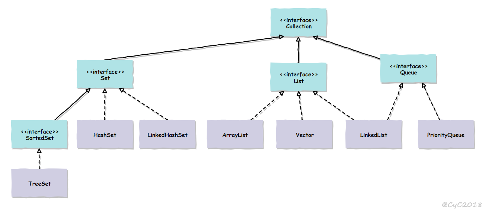
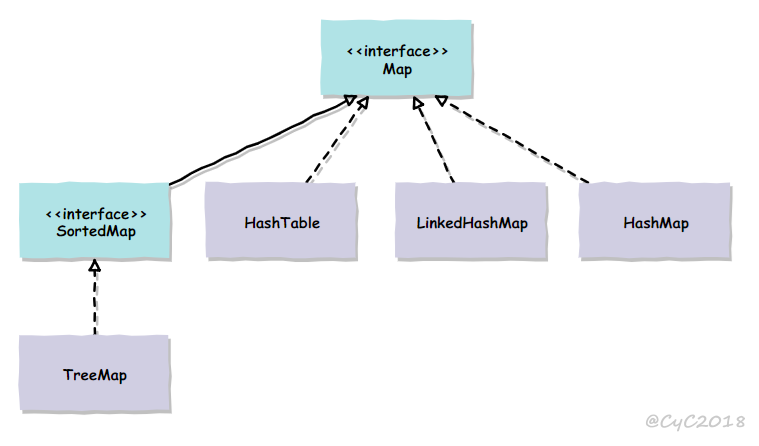
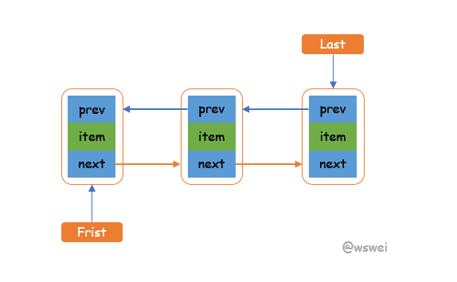

# 一、继承关系

 容器主要包括Collection和Map两种，Collection是存放对象的集合，Map是存放键值对的映射表

- ## **Collection**
 
    <div align="center"></div><br>

    - ### **Set**
        -  TreeSet:基于红黑树实现，支持有序性操作，例如根据某个范围查找对象，查找效率不如HashSet,HashSet为O(1),TreeSet为O(logN)
        -  HashSet：基于哈希表实现，支持快速查找，不支持有序操作，Iterator遍历HashSet得到的结果是不确定的
        -  LinkedHashSet:具有HashSet的查找顺序，内部使用双向链表维护元素的插入顺序

    - ### **List**
        - ArrayList:基于动态数组实现，支持随机访问
        - Vector:和ArrayList类似，线程安全
        - LinkedList:基于双向链表实现，可以快速地在链表中间插入元素，还可以作为栈、队列和双向队列
    - ### **Queue**
        - LinkedList:实现双向队列
        - PriorityQueue:基于堆结构实现，可以来实现优先队列

- ## **Map**

    <div align="center"></div><br>

    - ### TreeMap:基于红黑树事项
    - ### HashMap:基于哈希表实现
    - ### HashTable:遗留类
    - ### LinkedHashMap:使用双向链表来维护元素的顺序，顺序为插入顺序或者最近最少使用)(LRU)顺序

# 二、源码分析

- ## **ArrayList**
    - ### 概览
        ``` java
        public class ArrayList<E> extends AbstractList<E>
            implements List<E>, RandomAccess, Serializable
        ``` 
        实现了RandomAccess接口，支持随机访问，因为是基于数组实现的
        ``` java
        private static final int DEFAULT_CAPACITY = 10;
        ```
        数组大小默认为10个

    - ### 添加
        ``` java
        // 添加元素e
        public boolean add(E e) {
            // 确保容量足够
            ensureCapacityInternal(size + 1);  // Increments modCount!!
            // 添加e到ArrayList中
            elementData[size++] = e;
            return true;
        }

        // 确保容量足够
        private void ensureCapacityInternal(int minCapacity) {
            // calculateCapacity 计算所需要的容量
            ensureExplicitCapacity(calculateCapacity(elementData, minCapacity));
        }

        // 计算所需要的容量
        private static int calculateCapacity(Object[] elementData, int minCapacity) {
            if (elementData == DEFAULTCAPACITY_EMPTY_ELEMENTDATA) {
                return Math.max(DEFAULT_CAPACITY, minCapacity);
            }
            return minCapacity;
        }

        private void ensureExplicitCapacity(int minCapacity) {
            modCount++;

            // 如果容量不够，则需扩容
            // overflow-conscious code
            if (minCapacity - elementData.length > 0)
                grow(minCapacity);
        }

        private void grow(int minCapacity) {
            // overflow-conscious code
            int oldCapacity = elementData.length;
            int newCapacity = oldCapacity + (oldCapacity >> 1);
            if (newCapacity - minCapacity < 0)
                newCapacity = minCapacity;
            if (newCapacity - MAX_ARRAY_SIZE > 0)
                newCapacity = hugeCapacity(minCapacity);
            // minCapacity is usually close to size, so this is a win:
            elementData = Arrays.copyOf(elementData, newCapacity);
        }
        ```
        在添加元素时，使用ensureCapacityInternal来确保容量足够，如果不够使用grow方法进行扩容，新的容量大小为oldCapacity + (oldCapacity >> 1)，也就是原先的1.5倍

        扩容操作需要调用 Arrays.copyOf() 把原数组整个复制到新数组中，这个操作代价很高，因此最好在创建 ArrayList 对象时就指定大概的容量大小，减少扩容操作的次数。

    - ### 删除
        ``` java
        public E remove(int index) {
            // 检查是否越界
            rangeCheck(index);

            modCount++;
            E oldValue = elementData(index);

            int numMoved = size - index - 1;
            if (numMoved > 0)
                System.arraycopy(elementData, index+1, elementData, index,
                             numMoved);
            elementData[--size] = null; // clear to let GC do its work

            return oldValue;
        }
        ``` 
        使用System.arraycopy将index+1后面的元素复制到index位置，时间复杂度O(n),删除元素的代价是非常高的

    - ### fail-fast
        modCount用来记录ArrayList结构发生变化的次数，结构发生变化指的是添加、删除一个元素、调整内部数组大小，仅仅设置元素的值不算结构发生变化

        在进行序列化或者迭代操作时，需要比较操作前后modCount是否发生变化，如果发生变化则抛出ConcurrentModificationException

    - ### 序列化
        ArrayList基于数组实现，具有动态扩容性，因为保存元素的数组不一定被全部使用，所以在序列化是没必要序列化elementData
        ``` java
        transient Object[] elementData; // non-private to simplify nested class access
        ```

        ArrayList 实现了 writeObject() 和 readObject() 来控制只序列化数组中有元素填充那部分内容

- ## **Vector**
    - ### 同步
        ``` java
        public synchronized boolean add(E e) {
            modCount++;
            ensureCapacityHelper(elementCount + 1);
            elementData[elementCount++] = e;
            return true;
        }

        public synchronized E get(int index) {
            if (index >= elementCount)
                throw new ArrayIndexOutOfBoundsException(index);

            return elementData(index);
        }
        ```

        它的实现与 ArrayList 类似，但是使用了 synchronized 进行同步。

    - ### 与 ArrayList 的比较
        - Vector 是同步的，因此开销就比 ArrayList 要大，访问速度更慢。最好使用 ArrayList 而不是 Vector，因为同步操作完全可以由程序员自己来控制；
        - Vector 每次扩容请求其大小的 2 倍空间，而 ArrayList 是 1.5 倍。
            ``` java
            int newCapacity = oldCapacity + ((capacityIncrement > 0) ?
                capacityIncrement : oldCapacity);
            ```             
    - ### 替代方案
        可以使用 Collections.synchronizedList(); 得到一个线程安全的 ArrayList,通过看源码看其实还是synchronized修饰方法

        使用 concurrent 并发包下的 CopyOnWriteArrayList 类

- ## **CopyOnWriteArrayList**
    - ### 读写分离
        - 写操作在一个复制的数组上进行，读操作还是在原先的数组进行操作，读写互不影响
        - 写操作加锁，防止并发导致写入数据失败
        - 写操作结束后，需要将原始数组指向新的复制数组
         
        ``` java
        private transient volatile Object[] array;

        // 添加元素
        public boolean add(E e) {
            final ReentrantLock lock = this.lock;
            lock.lock();
            try {
                Object[] elements = getArray();
                int len = elements.length;
                Object[] newElements = Arrays.copyOf(elements, len + 1);
                newElements[len] = e;
                setArray(newElements);
                return true;
            } finally {
                lock.unlock();
            }
        }

        final Object[] getArray() {
            return array;
        }

        final void setArray(Object[] a) {
            array = a;
        }

        public E get(int index) {
            return get(getArray(), index);
        }
        ``` 

    - ### 使用场景
        CopyOnWriteArrayList 在写操作的同时允许读操作，大大提高了读操作的性能，因此很适合读多写少的应用场景

        CopyOnWriteArrayList的缺陷：
        
        - 内存占用：在写操作时需要复制一个新的数组，使得内存占用为原来的两倍左右
        - 数据不一致：读操作不能读取实时性的数据，因为部分写操作的数据还未同步到读数组中

        CopyOnWriteArrayList 不适合内存敏感以及对实时性要求很高的场景

- ## **LinkedList**
    - ### 概览
        基于双向链表实现，使用Node存储节点的信息
        ``` java
        private static class Node<E> {
            E item;
            Node<E> next;
            Node<E> prev;

            Node(Node<E> prev, E element, Node<E> next) {
                this.item = element;
                this.next = next;
                this.prev = prev;
            }
        }
        ```

        每个链表存储了Frist和last指针
        ``` java
        transient Node<E> first;

        transient Node<E> last;
        ```

        <div align="center"></div><br>

    - ### 添加
        ``` java
        public boolean add(E e) {
            linkLast(e);
            return true;
        }

        // 往链表的尾部添加元素
        void linkLast(E e) {
            final Node<E> l = last;
            final Node<E> newNode = new Node<>(l, e, null);
            last = newNode;
            if (l == null)
                first = newNode;
            else
                l.next = newNode;
            size++;
            modCount++;
        }

        // 往某个节点的前面插入节点
        void linkBefore(E e, Node<E> succ) {
            // assert succ != null;
            final Node<E> pred = succ.prev;
            final Node<E> newNode = new Node<>(pred, e, succ);
            succ.prev = newNode;
            if (pred == null)
                first = newNode;
            else
                pred.next = newNode;
            size++;
            modCount++;
        }
        ``` 

    - ### 删除
        ``` java
        public E remove(int index) {
            checkElementIndex(index);
            return unlink(node(index));
        }

        E unlink(Node<E> x) {
            // assert x != null;
            final E element = x.item;
            final Node<E> next = x.next;
            final Node<E> prev = x.prev;

            if (prev == null) {
                first = next;
            } else {
                prev.next = next;
                x.prev = null;
            }

            if (next == null) {
                last = prev;
            } else {
                next.prev = prev;
                x.next = null;
            }

            x.item = null;
            size--;
            modCount++;
            return element;
        }
        ```

    - ### 与 ArrayList 的比较
        - ArrayList 基于动态数组实现，LinkedList 基于双向链表实现
        - ArrayList 支持随机访问，LinkedList 不支持
        - LinkedList 在任意位置添加删除元素更快

- ## **HashMap**
    ``` java
    public V put(K key, V value) {
        return putVal(hash(key), key, value, false, true);
    }
    ```
    
- ## **CurrentHashMap**  
