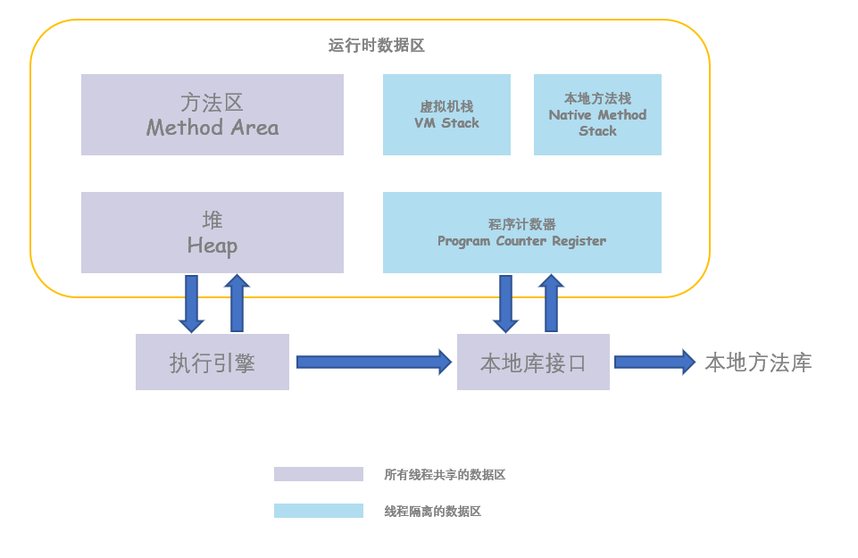

# 一、运行时数据区
- ## 运行时数据区域

    

 

- ## 程序计数器
    
    程序计数器是一块很小的内存区域，可以看做当前线程所执行的字节码的行号指示器；字节码解释器通过改变这个计数器的值来选取下一条需要执行的字节码指令，分支、跳转、循环、异常处理、线程恢复等基础功能都需要依赖这个程序计数器；如果正在执行的是本地方法则为空。

- ## Java虚拟机栈

    每个方法在执行的同时会创建一个栈帧用于储存局部变量表、操作数栈、常量池引用等信息。方法调用直至执行完成的过程，就对应着一个栈帧在Java虚拟机栈中入栈和出栈的过程