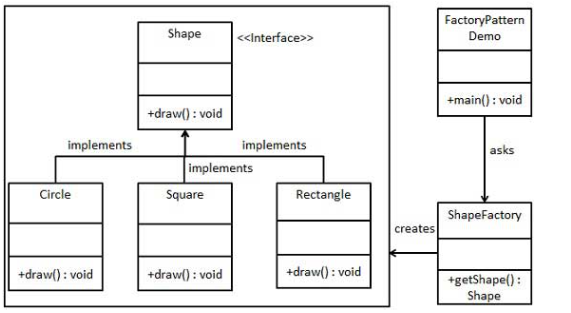
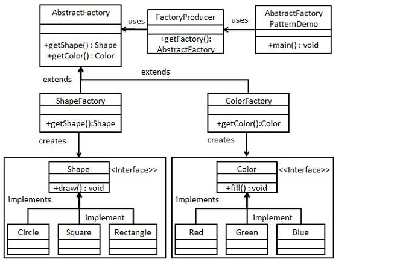
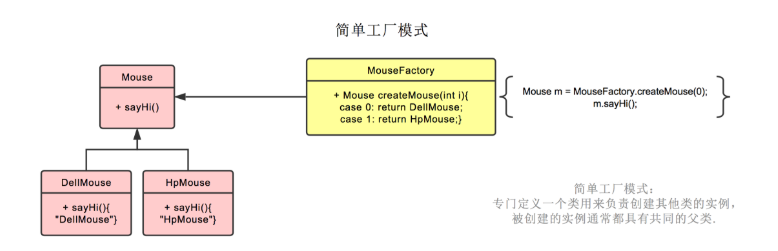
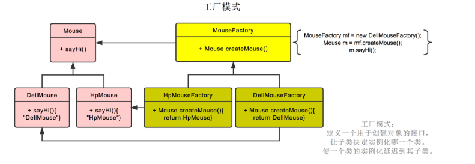
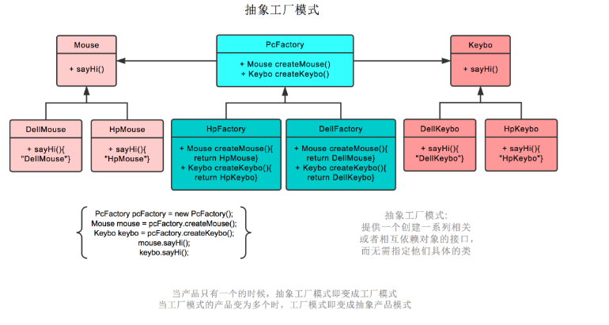
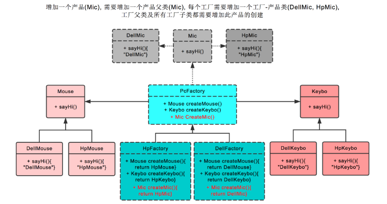
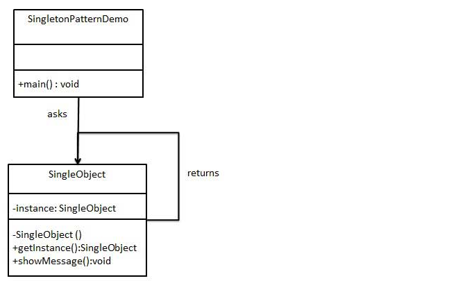
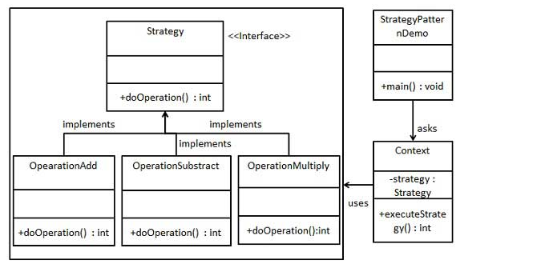

# Java设计模式

# 工厂模式
- 应用实例
  - 需要一辆汽车，可以直接从工厂里面提货，而不用去管这辆汽车是怎么做出来的，以及这个汽车里面的具体实现。
  - Hibernate 换数据库只需换方言和驱动就可以。


# 抽象工厂模式
- 应用实例
  - 假设家中某一个衣柜（具体工厂）只能存放某一种这样的衣服（成套，一系列具体产品），每次拿这种成套的衣服时也自然要从这个衣柜中取出了。用 OOP 的思想去理解，所有的衣柜（具体工厂）都是衣柜类的（抽象工厂）某一个，而每一件成套的衣服又包括具体的上衣（某一具体产品），裤子（某一具体产品），这些具体的上衣其实也都是上衣（抽象产品），具体的裤子也都是裤子（另一个抽象产品）


# 案例分析
下面例子中鼠标，键盘，耳麦为产品，惠普，戴尔为工厂。
## 简单工厂模式
下图中的鼠标工厂，专业生产鼠标，给参数 0，生产戴尔鼠标，给参数 1，生产惠普鼠标。


## 工厂模式
工厂模式也就是鼠标工厂是个父类，有生产鼠标这个接口。

戴尔鼠标工厂，惠普鼠标工厂继承它，可以分别生产戴尔鼠标，惠普鼠标。

生产哪种鼠标不再由参数决定，而是创建鼠标工厂时，由戴尔鼠标工厂创建。

后续直接调用鼠标工厂.生产鼠标()即可



## 抽象工厂模式
抽象工厂模式也就是不仅生产鼠标，同时生产键盘。

也就是 PC 厂商是个父类，有生产鼠标，生产键盘两个接口。

戴尔工厂，惠普工厂继承它，可以分别生产戴尔鼠标+戴尔键盘，和惠普鼠标+惠普键盘。

创建工厂时，由戴尔工厂创建。

后续工厂.生产鼠标()则生产戴尔鼠标，工厂.生产键盘()则生产戴尔键盘。



`在抽象工厂模式中，假设我们需要增加一个工厂`


# 单例模式
- 应用实例
  - Windows 是多进程多线程的，在操作一个文件的时候，就不可避免地出现多个进程或线程同时操作一个文件的现象，所以所有文件的处理必须通过唯一的实例来进行。
  - 一些设备管理器常常设计为单例模式，比如一个电脑有两台打印机，在输出的时候就要处理不能两台打印机打印同一个文件。
  - 使用场景 I/O 与数据库的连接等
  

# 单例模式的几种实现方式
## 懒汉式，线程不安全
是否 Lazy 初始化：是

是否多线程安全：否

实现难度：易

描述：这种方式是最基本的实现方式，这种实现最大的问题就是不支持多线程。因为没有加锁 synchronized，所以严格意义上它并不算单例模式。
这种方式 lazy loading 很明显，不要求线程安全，在多线程不能正常工作。

```
public class Singleton {  
    private static Singleton instance;  
    private Singleton (){}  
  
    public static Singleton getInstance() {  
    if (instance == null) {  
        instance = new Singleton();  
    }  
    return instance;  
    }  
}
```

## 懒汉式，线程安全
是否 Lazy 初始化：是

是否多线程安全：是

实现难度：易

描述：这种方式具备很好的 lazy loading，能够在多线程中很好的工作，但是，效率很低，99% 情况下不需要同步。
优点：第一次调用才初始化，避免内存浪费。
缺点：必须加锁 synchronized 才能保证单例，但加锁会影响效率。
getInstance() 的性能对应用程序不是很关键（该方法使用不太频繁）。

```
public class Singleton {  
    private static Singleton instance;  
    private Singleton (){}  
    public static synchronized Singleton getInstance() {  
    if (instance == null) {  
        instance = new Singleton();  
    }  
    return instance;  
    }  
}
```

## 饿汉式
是否 Lazy 初始化：否

是否多线程安全：是

实现难度：易

描述：这种方式比较常用，但容易产生垃圾对象。
优点：没有加锁，执行效率会提高。
缺点：类加载时就初始化，浪费内存。
它基于 classloader 机制避免了多线程的同步问题，不过，instance 在类装载时就实例化，虽然导致类装载的原因有很多种，在单例模式中大多数都是调用 getInstance 方法， 但是也不能确定有其他的方式（或者其他的静态方法）导致类装载，这时候初始化 instance 显然没有达到 lazy loading 的效果。
```
public class Singleton {  
    private static Singleton instance = new Singleton();  
    private Singleton (){}  
    public static Singleton getInstance() {  
    return instance;  
    }  
}
```
## 双检锁/双重校验锁（DCL，即 double-checked locking）
JDK 版本：JDK1.5 起

是否 Lazy 初始化：是

是否多线程安全：是

实现难度：较复杂

描述：这种方式采用双锁机制，安全且在多线程情况下能保持高性能。
getInstance() 的性能对应用程序很关键。
```
public class Singleton {  
    private volatile static Singleton singleton;  
    private Singleton (){}  
    public static Singleton getSingleton() {  
    if (singleton == null) {  
        synchronized (Singleton.class) {  
        if (singleton == null) {  
            singleton = new Singleton();  
        }  
        }  
    }  
    return singleton;  
    }  
}
```

## 登记式/静态内部类
是否 Lazy 初始化：是

是否多线程安全：是

实现难度：一般

```
public class Singleton {  
    private static class SingletonHolder {  
    private static final Singleton INSTANCE = new Singleton();  
    }  
    private Singleton (){}  
    public static final Singleton getInstance() {  
    return SingletonHolder.INSTANCE;  
    }  
}
```
## 枚举
```
public enum Singleton {  
    INSTANCE;  
    public void whateverMethod() {  
    }  
}
```

# 策略模式
- 在策略模式（Strategy Pattern）中，一个类的行为或其算法可以在运行时更改
  
  