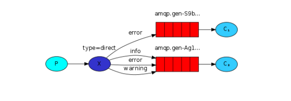

# RabbitMQ使用指南

官网  https://www.rabbitmq.com/getstarted.html、https://www.rabbitmq.com/java-client.html
## 基本操作命令
查询所有用户 

rabbitmqctl list_users

rabbitmqctl add_user xhj xhj

rabbitmqctl set_user_tags xhj administrator

RabbitMQ中的角色分为如下五类：none、management、policymaker、monitoring、administrator

* none 
不能访问 management plugin

* management 

用户可以通过AMQP做的任何事外加： 
列出自己可以通过AMQP登入的virtual hosts 
查看自己的virtual hosts中的queues, exchanges 和 bindings 
查看和关闭自己的channels 和 connections 
查看有关自己的virtual hosts的“全局”的统计信息，包含其他用户在这些virtual hosts中的活动。

* policymaker 

management可以做的任何事外加： 
查看、创建和删除自己的virtual hosts所属的policies和parameters

* monitoring 

management可以做的任何事外加： 
列出所有virtual hosts，包括他们不能登录的virtual hosts 
查看其他用户的connections和channels 
查看节点级别的数据如clustering和memory使用情况 
查看真正的关于所有virtual hosts的全局的统计信息

* administrator 

policymaker和monitoring可以做的任何事外加: 
创建和删除virtual hosts 
查看、创建和删除users 
查看创建和删除permissions 
关闭其他用户的connections

设置权限
rabbitmqctl set_permissions -p / xhj ".*" ".*" ".*"

rabbit的模式

# 6中消息类型
## 1. 简单队列模式

## 2.Work queues队列


1. Round-robin （轮询分发）
0. fairdispath （公平分发）

```java
//公平分发，必须关闭自动应答
boolean autoAck = false;
channel.basicConsume(QUEUE_NAME, autoAck, deliverCallback,cancelCallback -> { });
```

## 消息应答与持久化

* boolean autoAck = true;(自动确认模式)一旦 RabbitMQ 将消息分发给了消费者，就会从内存中删除。
在这种情况下，如果杀死正在执行任务的消费者，会丢失正在处理的消息，也会丢失已经分发给这个消
费者但尚未处理的消息。

* boolean autoAck = false; (手动确认模式) 我们不想丢失任何任务，如果有一个消费者挂掉了，那么
我们应该将分发给它的任务交付给另一个消费者去处理。 为了确保消息不会丢失，RabbitMQ 支持消
息应答。消费者发送一个消息应答，告诉 RabbitMQ 这个消息已经接收并且处理完毕了。RabbitMQ 可
以删除它了

### 持久化
```java
channel.queueDeclare(QUEUE_NAME, true, false, false, null);
```
第二个参数声明持久化 true 

我们还是运行1个生产者，2个消费者，在消息处理过程中，人为让一个消费者挂掉，然后会看到剩下的任务都会被另外的消费者执行。

# 订阅模式(Publish/Subscribe)


# 路由模式 


# topic模式


# RabbitMQ 之消息确认机制（事务+Confirm） 

# 事务
# Confirm 模式

[参考](rabbitmq/RabbitMQ实战.pdf) 


