# 一、IOC(基于注解驱动开发)
- ## 常用注解
    - ### **模式注解**
        **@Component**, **@Controller**, **@Service**, **@Repository**, **@Configuration**
    - ### **@Bean**
        - initMethod 初始化
        - destroyMethod 销毁方法 **prototype模式下不会调用，需自己调用销毁方法**
    - ### **@ComponentScan** 包扫描 
        - value : 指定要扫描的包
        - excludeFilters = Filter[]:扫描时按照什么规则排除那些组件
        - includeFilters = Filter[]:扫描时只包含那些组件 **记得禁用useDefaultFilters**
    - ### **@Scope** 作用域
        - singleton 单例
        - prototype 原型
        - request
        - session  
    - ### **@Lazy** 懒加载 只针对Singleton
    - ### **@Conditional** 按照条件装配Bean
        ``` java
        public @interface Conditional {
            Class<? extends Condition>[] value();
        }

        public interface Condition {
            boolean matches(ConditionContext context, AnnotatedTypeMetadata metadata);
        }
        ``` 
    - ### **@Import** 快速导入组件
        - @Import(@Component)
        - @Import(ImportSelector)
            ``` java
            public interface ImportSelector {

                // 返回要导入组件(@Component)的全类名
                // importingClassMetadata：当前标注@Import类上的所有注解信息
	            String[] selectImports(AnnotationMetadata importingClassMetadata);
            }
            ```
        - @Import(ImportBeanDefinitionRegistrar)
            ``` java
            public interface ImportBeanDefinitionRegistrar {

                // @param importingClassMetadata 当前标注@Import类上的所有注解信息
                // @param registry 当前容器的BeanDefinitionRegistry
                public void registerBeanDefinitions(AnnotationMetadataimportingClassMetadata, BeanDefinitionRegistry registry);

            }
            ``` 
    - ### **FactoryBean** 工厂Bean,可以通过实现该接口定制实例Bean的逻辑
        ``` java
        public interface FactoryBean<T> {
            // 获取实例
            T getObject() throws Exception;

            // 实例类型
            Class<?> getObjectType();

            // 是否是单实例，默认为是
            default boolean isSingleton() { return true; }
        }
        ``` 
    - ### **InitializingBean** 初始化Bean
        Bean所有的属性全部设置好后，调用实现该接口的方法,例如我们可以用它来检查Bean所有的属性是否设置正确
        ``` java
        public interface InitializingBean {
            // Bean所有的属性全部设置好后
            void afterPropertiesSet() throws Exception;
        }

        //通过查看源码可以看出，容器先调用InitailizingBean的afterPropertiesSet()方法，在调用init-method
        protected void invokeInitMethods(String beanName, final Object bean RootBeanDefinition mbd) throws Throwable {
            boolean isInitializingBean = (bean instanceof InitializingBean);
            
            ......
            ((InitializingBean) bean).afterPropertiesSet();
            ......

            invokeCustomInitMethod(beanName, bean, mbd);
            .......
        }
        ``` 
    - ### **DisposableBean**  销毁Bean
        容器关闭时，先调用DisposableBean的销毁方法，然后在调用Bean的destory-method
        ``` java
        public interface DisposableBean {
            // 销毁Bean
            void destroy() throws Exception;
        }

        // 先调用DisposableBean的销毁方法
        ((DisposableBean) this.bean).destroy();

        // 然后在调用Bean的destory-method
        invokeCustomDestroyMethod(this.destroyMethod);
        ``` 
    - ### **@PostConstruct** 和 **@PreDestroy** 
        JSR250规范,这两个注解分别是后置构建和前置销毁Bean，调用优先级高于前面所将的初始化和销毁Bean的方式，他们其实是通过**BeanPostProcessor**(后置处理器) **CommonAnnotationBeanPostProcessor(InitDestroyAnnotationBeanPostProcessor)** 来进行初始化的  

    - ## **BeanPostProcessor** Bean的后置处理器
        ``` java
        public interface BeanPostProcessor {
            // 在Bean初始化之前
            default Object postProcessBeforeInitialization(Object bean, String beanName){
		        return bean;
	        }

            // 在Bean初始化之后
            default Object postProcessAfterInitialization(Object bean, String beanName){
		        return bean;
	        }
        }
        ``` 
        <div align="center">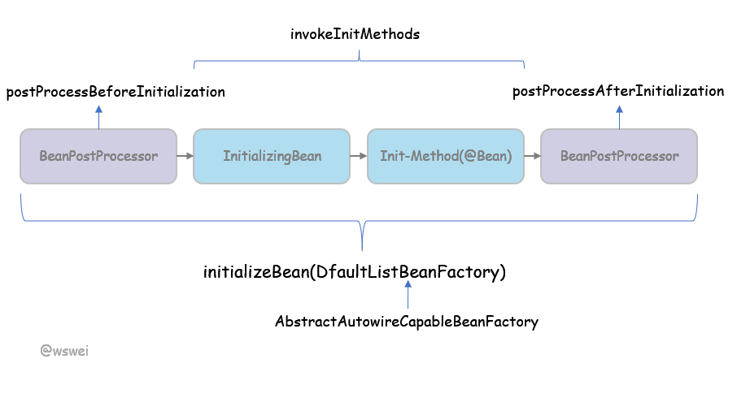</div><br>

        Bean的初始化(initialieBean)均在**populateBean**属性赋值之后完成

        **populateBean**主要是解决依赖，属性赋值
        ``` java
        protected Object doCreateBean(final String beanName, final RootBeanDefinition mbd, final @Nullable Object[] args){
            .....
            Object exposedObject = bean;
            populateBean(beanName, mbd, instanceWrapper);
		    exposedObject = initializeBean(beanName, exposedObject, mbd);
            .....
        }
        ```

        Spring中几个重要的实现：
        
        **ApplicationContextAwareProcessor**  判别**Aware**,并且设置相应的值
        <div align="center">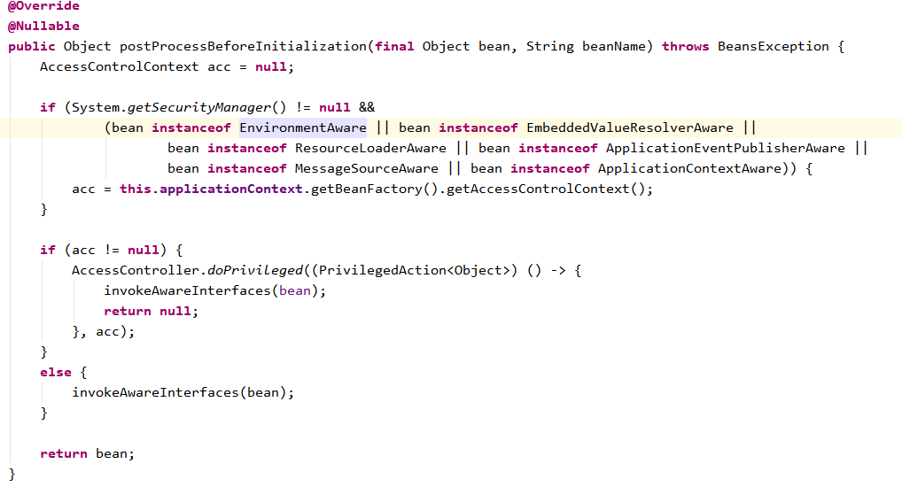</div><br>

        **BeanValidationPostProcessor** Bean的校验,和**JSR-303 Validator**配合实现Bean的属性校验

        **InitDestroyAnnotationBeanPostProcessor** 处理 **@PostConstruct** 和 **@PreDestroy**注解

        **AutowiredAnnotationBeanPostProcessor** 处理自动注入 **@Autowired** 和 **JSR-330 @Inject** 注解

    - ## **InstantiationAwareBeanPostProcessor**
        **InstantiationAwareBeanPostProcessor**继承自BeanPostProcessor，执行时间靠前
        ``` java
        protected Object createBean(String beanName, RootBeanDefinition mdb, Objects[] args) throws BeanCreationException{

            ...
            try{
                // 让InstantiationAwareBeanPostProcessor在这一步有机会返回代理
                Object bean = resolveBeforeInstantistion(beanName, mbdToUse);
                if(bean != null){
                    return bean;
                }
            }
            ...
            // BeanPostProcessor是在这里实例化后才能得到执行
            Object bean = doCreateBean(beanName, mdbToUse, args);
            ...
            return beanInstance;

        }
        ```

        ``` java
        public interface InstantiationAwareBeanPostProcessor extends BeanPostProcessor {

            default Object postProcessBeforeInstantiation(Class<?> beanClass, String beanName) throws BeansException {
		        return null;
	        }

            default boolean postProcessAfterInstantiation(Object bean, String beanName) throws BeansException {
		        return true;
	        }

            default PropertyValues postProcessProperties(PropertyValues pvs, Object bean, String beanName) throws BeansException {
		        return null;
	        }
        }
        ``` 

    - ## **BeanFactoryPostProcessor**  BeanFactory的后置处理器
        BeanFactoryPostProcessor是Bean工厂的后置处理，而BeanPostProcessor是Bean的后置处理器，两者完全不同
        BeanFactoryPostProcessor可以在实例化之前修改Bean的定义(**BeanDefinition**),或者注册Bean,可以通过设置Order来规定其执行顺序
        ``` java
        public interface BeanFactoryPostProcessor {
            void postProcessBeanFactory(ConfigurableListableBeanFactory beanFactory)
        }
        ```
        BeanFactoryPostProcessor及其子类的调用流程
        <div align="center">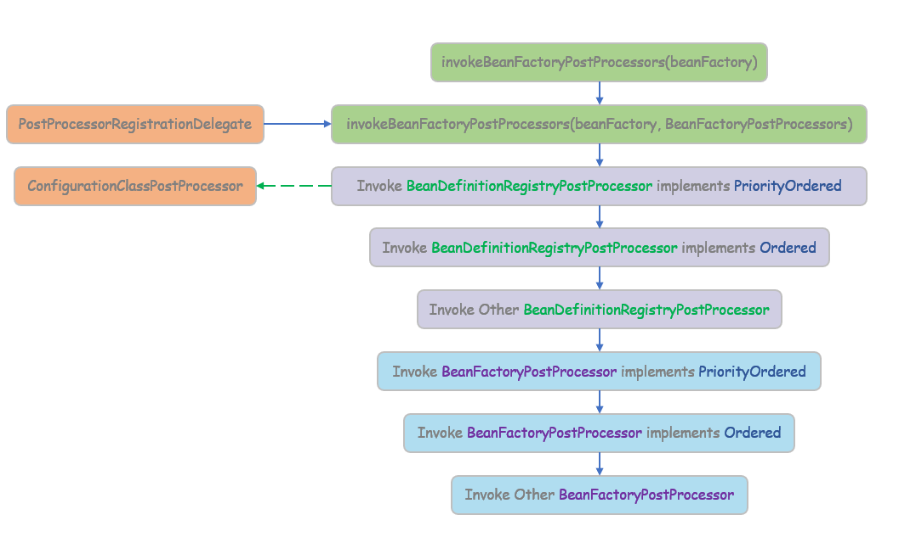</div><br>

    - ## **BeanDefinitionRegistryPostProcessor**
        在BeanFactoryPostProcssor执行之前，向容器中注册Bean定义
        ``` java
        public interface BeanDefinitionRegistryPostProcessor extends BeanFactoryPostProcessor {

            void postProcessBeanDefinitionRegistry(BeanDefinitionRegistry registry) throws BeansException;

        }
        ``` 

    - ## **ApplicationListener**
        容器事件监听器 
        ``` java
        public interface ApplicationListener<E extends ApplicationEvent> extends EventListener {
            void onApplicationEvent(E event);
        }
        ```

    - ## **@Value** 属性赋值
        - ### 基本赋值 @Value(value)
        - ### SpringEL表达式 @Value("#{value}")
        - ### 取配置文件的值 @PropertySource  @Value("${value}")
        - ### 使用@PropertySource是配置文件的键值对加载到**Environment**中,可以使用Environment来获取对应的值
            ``` java
            @Component
            @PropertySource("classpath:/jdbc.properties")
            public class DataSourceConfig implements EnvironmentAware {

	            private Environment environment;

                @Value("${jdbc.username}")
                private String username;

                @Value("${jdbc.password}")
                private String password;
                
                public String getPropertyValue(String key) {
                    return environment.getProperty(key);
                }

                @Override
                public void setEnvironment(Environment environment) {
                    this.environment =  environment;
                }

            }
            ```  
        - ### 实现原理简析看下面的 **ConfigurationClassPostProcessor**
         
    - ## **@Autowired** 自动注入
        - ### 优先按照类型从容器寻找相应的实例
        - ### 如果有多个组件，再将属性名作为BeanName从容器中寻找
        - ### 使用 **@Qualifier**
    - ## **@Qualifier**
    - ## **@Primary** 自动装配首选装配的Bean
    - ## **@Resource** JSR-250 自动装配
    - ## **@Inject** JSR-330 自动装配
    - ## **AutowiredAnnotationBeanPostProcessor**
        <div align="center">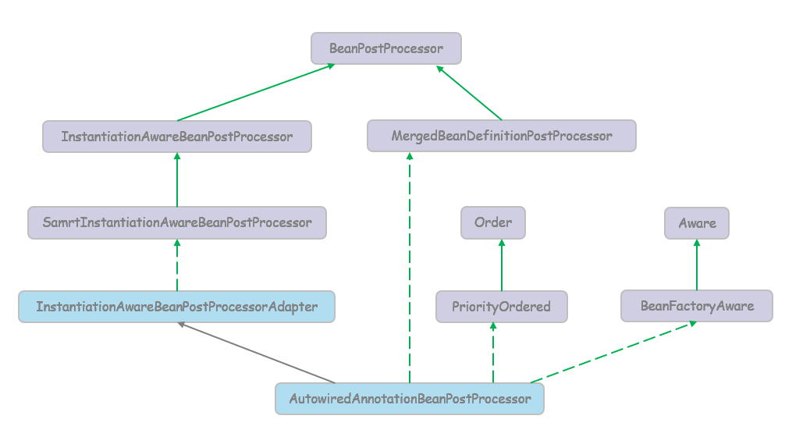</div><br> 

        发现自动注入的相关注解，并且生成InjectMetadate
        <div align="center">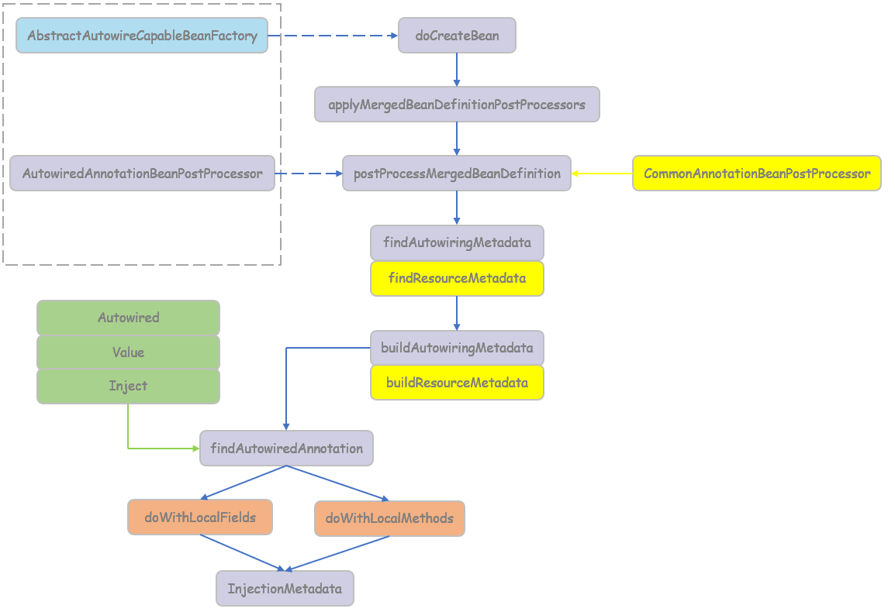</div><br> 
        CommonAnnotationBeanPostProcessot是用来处理@Resource,@EJB等注解的

        

    - ### 循环依赖以及解决方式

        容器在实例化A时，发现A依赖于B，就去实例化B；实例B时，发现B有依赖于A，造成依赖循环。

        IOC容器再次发现B依赖于A时，会获取A对象一个早期引用(early reference),并且把这个早期引用注入到容器中，让B先完成实例化，B完成实例化后，A就可以获取B的引用，随之A实例完成

        早期引用是通过构造器进行创建的，所以Spring无法解决构造器的循环依赖

        - #### 循环依赖的场景
            1.构造器的循环依赖 EROR Spring无法解决
            ``` java
            @Service
            public class ServiceAimpl implements ServiceA{

                @Autowired
	            public ServiceAimpl(ServiceB serviceB) {
		            this.serviceB = serviceB;

                 @Override
	            public void sayHelloA() {
		            serviceB.sayHelloB();
	            }
	        }

            @Service
            public class ServiceBimpl implements ServiceB {

	            @Autowired
	            public ServiceBimpl(ServiceA serviceA) {
		            this.serviceA = serviceA;
	            }

	            @Override
	            public void sayHelloB() {
		            serviceA.sayHelloA();
	            }
            }
            ```

            2.field属性的循环依赖
            ``` java
            @Service
            public class ServiceAimpl implements ServiceA{

                @Autowired
                private ServiceB serviceB;
                
                @Override
                public void sayHelloA() {
                    serviceB.sayHelloB();
                }
            }

            @Service
            public class ServiceBimpl implements ServiceB {

                @Autowired
                private ServiceA serviceA;

                @Override
                public void sayHelloB() {
                    serviceA.sayHelloA();
                }
            }
            ```  
        - #### 三级缓存
            1. **SingletonObjects** 存放完全初始化好的Bean,从该缓存中取出的Bean可以直接用
            2. **EarlySingletonObjects** 存放原始的Bean对象(属性未进行填充),用于解决循环依赖
            3. **SinglentonFactories** 存放单例工厂对象，用于解决循环依赖
            ``` java
            public class DefaultSingletonBeanRegistry extends SimpleAliasRegistry implements SingletonBeanRegistry {
                /** Cache of singleton objects: bean name --> bean instance */
	            private final Map<String, Object> singletonObjects = new ConcurrentHashMap<String, Object>(256);

	            /** Cache of singleton factories: bean name --> ObjectFactory */
	            private final Map<String, ObjectFactory<?>> singletonFactories = new HashMap<String, ObjectFactory<?>>(16);

	            /** Cache of early singleton objects: bean name --> bean instance */
	            private final Map<String, Object> earlySingletonObjects = new HashMap<String, Object>(16);
            }
            ```
        - #### 解决循环依赖 
            <div align="center">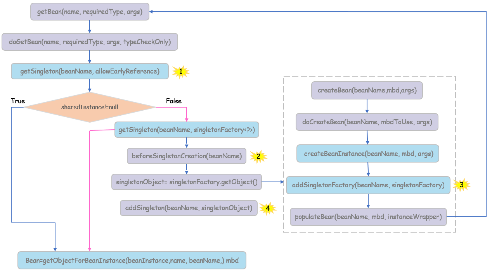</div><br>
            IOC容器在获取Bean时，先去执行getSingleton(beanName,allowEarlyReference),根据不同的条件从不同的缓存中获取对应Bean对象,图中的1

            ``` java
            protected Object getSingleton(String beanName, boolean allowEarlyReference) {
                    // 先从一级缓存singletonObjects中获取对应的bean对象
		            Object singletonObject = this.singletonObjects.get(beanName);
                    // 如果没有获取到，并且最近创建对象缓存singletonsCurrentlyInCreation中含有此Bean对象，则进行下一步操作
		            if (singletonObject == null && isSingletonCurrentlyInCreation(beanName)) {
			            synchronized (this.singletonObjects) {
                            //从存放原始Bean对象的缓存EarlySingletonObjects中获取原始Bean对象
				        singletonObject = this.earlySingletonObjects.get(beanName);
                            //如果原始Bean对象不存在并且容器允许获取原始Bean对象，则进行下一步操作
				        if (singletonObject == null && allowEarlyReference) {
                                    //从存放单例对象工厂缓存SinglentonFactories中获取单例对象工厂
					        ObjectFactory<?> singletonFactory = this.singletonFactories.get(beanName);
                                    //如果存在单例对象工厂
					        if (singletonFactory != null) {
                                            //从单例对象工厂中获取原始对象
						        singletonObject = singletonFactory.getObject();
                                            //将获取的原始对象放到原始对象缓存中
						        this.earlySingletonObjects.put(beanName, singletonObject);
                                            //与此同时，将对应的单例对象工程从缓存中移除
						        this.singletonFactories.remove(beanName);
					        }
				        }
			        }
		        }
		        return singletonObject;
	        }
            ```

            容器如果没有获取Bean对象,则去创建Bean对象，在创建Bean对象时，会先把Bean的名字放到singletonsCurrentlyInCreation缓存中，图中的2

            ``` java
            public Object getSingleton(String beanName, ObjectFactory<?> singletonFactory) {
                Object singletonObject = this.singletonObjects.get(beanName);
                if (singletonObject == null) {
                    ....
                    // 把Bean的名字放到singletonsCurrentlyInCreation缓存中
                    beforeSingletonCreation(beanName)
                    boolean newSingleton = false;
                    ....
                    // 创建对象，会调用doCreateBean方法创建对象
                    singletonObject = singletonFactory.getObject();
                    newSingleton = true;
                    ....
                    // 已完成对象的创建，将创建好的单例Bean对象缓存到SingletonObjects中去
                    if (newSingleton) {
                        addSingleton(beanName, singletonObject);
                    }
                }
            }

            protected void beforeSingletonCreation(String beanName) {
                if (!this.inCreationCheckExclusions.contains(beanName) && !this.singletonsCurrentlyInCreation.add(beanName)) {
			        throw new BeanCurrentlyInCreationException(beanName);
		        }
            }
            ```    

            容器调用doCreateBean方法进行Bean的创建等工作,大概步骤如下

            ``` java
            protected Object doCreateBean(final String beanName, final RootBeanDefinition mbd, final Object[] args){
                BeanWrapper instanceWrapper = null;
		        ....
                // createBeanInstance会使用工厂方法或者构造器创建一个空属性Bean对象
		        if (instanceWrapper == null) {
			        instanceWrapper = createBeanInstance(beanName, mbd, args);
		        }
		        final Object bean = instanceWrapper.getWrappedInstance();
		        Class<?> beanType = instanceWrapper.getWrappedClass();
                ....
                // 解决依赖循环，如果是单实例，允许依赖循环并且singletonsCurrentlyInCreation含有此Bean对象的名字，则把创建原始对象的工厂放到SinglentonFactories缓存中
                boolean earlySingletonExposure = (mbd.isSingleton() && this.allowCircularReferences &&
				isSingletonCurrentlyInCreation(beanName));
                if (earlySingletonExposure) {
                    addSingletonFactory(beanName, () -> getEarlyBeanReference(beanName, mbd, bean));
                }
                Object exposedObject = bean;
                ....
                // 属性赋值，解决依赖，如果发现依赖会重复上面的过程
                populateBean(beanName, mbd, instanceWrapper);
                // Bean对象属性和依赖已解决,初始化Bean对象
                exposedObject = initializeBean(beanName, exposedObject, mbd);
                ....
            }
            ```         

# 二、AOP
- 基于动态代理实现，默认使用接口，用JDK提供的动态代理实现；如果没有接口使用CGLIB实现
- Spring AOP需要依赖于IOC容器来管理
- Spring AOP只能作用于Spring中的Bean，他是用纯java代码实现的，只能作用于Bean中的方法
- Spring提供了AspectJ的支持
- Spring AOP基于代理实现，在容器启动时需要生成代理对象，在方法调用上增加了栈的深度，性能不如AspectJ
- 使用方式：
    - 定义切面,例如
        ``` java
        @Component("logArgsAdvice")
        public class LogArgsAdvice implements MethodBeforeAdvice {

            @Override
            public void before(Method method, Object[] args, Object target) {
                LOGGER.info("The method is {}, and args is {}, and target is {}.", method, Arrays.toString(args), target);
            }
        }
        ``` 
    - 继承或者使用Advisor,注入ProxyBeanFactory,Advisor有好几个默认的实现类
        - NameMatchMethodPointcutAdvisor 提供方法名，符合配置的方法才会拦截
            ``` java
            //从上面的继承关系可以看出ProxyFactoryBean其实是一个工厂Bean，返回对应对象的代理对象
            public class ProxyFactoryBean extends ProxyCreatorSupport
		    implements FactoryBean<Object>, BeanClassLoaderAware, BeanFactoryAware {
                .....
            }

            @Bean
            public ProxyFactoryBean userServiceProxy(UserSerice defaultUserSerice) throws ClassNotFoundException {
                ProxyFactoryBean proxyFactoryBean = new ProxyFactoryBean();
                proxyFactoryBean.setProxyInterfaces(new Class<?>[]{UserSerice.class});
                proxyFactoryBean.setTarget(defaultUserSerice);
                proxyFactoryBean.setInterceptorNames("nameMatchMethodAdvisor");
                return proxyFactoryBean;
            }

            @Bean("nameMatchMethodAdvisor")
            public Advisor nameMatchMethodPointcutAdvisor(Advice logArgsAdvice){
                NameMatchMethodPointcutAdvisor advisor = new NameMatchMethodPointcutAdvisor();
                advisor.setAdvice(logArgsAdvice);
                advisor.setMappedNames("getUserName");
                return advisor;
            }

            // 因为使用的时
            UserSerice userSerice = (UserSerice) applicationContext.getBean("userServiceProxy");
            userSerice.getUserName("123")
            ```
    - autoproxy 自动代理，Spring发现一个Bean需要被切面织入时，会自动生成对应Bean的代理来拦截方法的执行
        - BeanNameAutoProxyCreator 使用正则匹配Bean的名字，
            ``` java
            @Bean
            public BeanNameAutoProxyCreator beanNameAutoProxyCreator(){
                BeanNameAutoProxyCreator beanNameAutoProxyCreator = new BeanNameAutoProxyCreator();
                beanNameAutoProxyCreator.setInterceptorNames("logArgsAdvice");
                beanNameAutoProxyCreator.setBeanNames("defaultUserSerice");
                return beanNameAutoProxyCreator;
            }

            UserSerice userSerice = applicationContext.getBean(UserSerice.class);
            userSerice.getUserName("123");
            ``` 
        - RegexpMethodPointcutAdvisor 正则匹配
        - DefaultAdvisorAutoProxyCreator
         
    - @EnableAspectJAutoProxy 基于注解自动代理
        - @Aspect 把当前的类标识为一个切面
        - @Before 前置增强方法，相当于BeforeAdvice
        - @After final增强，不管是抛出异常或者正常退出都会执行
        - @AfterReturning  后置增强，方法正常退出时执行，相当于AfterReturningAdvice
        - @AfterThrowing 异常抛出增强，相当于ThrowsAdvice
        - @Around 环绕增强，相当于MethodInterceptor
        - execution切点函数
            execution函数用于匹配方法执行的连接点，语法为

            execution(方法参数修饰符[可选] **返回类型** **方法名** **参数** 异常模式[可选])

            允许使用通配符：
            * '*' 匹配任意字符，但只能匹配一个元素
            * '..' 匹配任意字符，可以匹配任意多个元素，表示类时必须和*联合使用
            * '+' 必须跟在类后面，表示类本身或扩展制定类的所有类
        - JoinPoint 连接点  
        - AspectJ指示器
             <div align="center">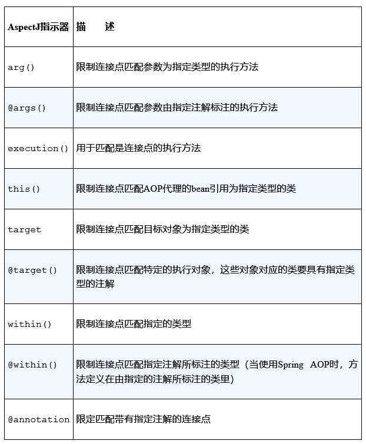</div><br>
- 源码分析
    - **@EnableAspectJAutoProxy**
        通过使用 **@Import** 导入 **AspectJAutoProxyRegistrar**，**AspectJAutoProxyRegistrar** 会把 **AnnotationAwareAspectJAutoProxyCreator** 注册到容器中

        **AnnotationAwareAspectJAutoProxyCreator** 的继承关系如下：

        <div align="center">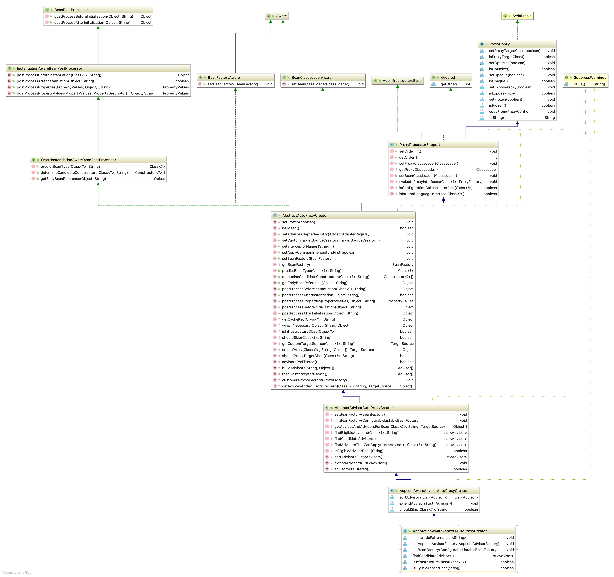</div><br>

        从继承关系中，我们可以看出**AnnotationAwareAspectJAutoProxyCreator** 实现了 **BeanPostProcessor** 接口， 我猜测它可以在Bean的初始化时创建Bean的代理对象


                    
# 三、Spring MVC

<div align="center"></div><br>

- ## 基于配置文件
    tomcat启动时，会根据web.xml中的配置进行初始化，下面是web.xml的最简配置，其实listener不是必须的，这里配置上，是为了下面分析springmvc是如何加载父容器的
    ``` xml
    <context-param>
        <param-name>contextConfigLocation</param-name>
        <param-value>classpath:config/applicationContext.xml</param-value>
    </context-param>
    <listener>
        <listener-class>org.springframework.web.context.ContextLoaderListener</listener-class>
    </listener>

    <servlet>
        <servlet-name>dispatcherServket</servlet-name>
        <servlet-class>org.springframework.web.servlet.DispatcherServlet</servlet-class>
        <init-param>
            <param-name>contextConfigLocation</param-name>
            <param-value>classpath:config/springmvc.xml</param-value>
        </init-param>
        <load-on-startup>1</load-on-startup>
    </servlet>

    <servlet-mapping>
        <servlet-name>dispatcherServket</servlet-name>
        <url-pattern>/</url-pattern>
    </servlet-mapping>
    ```
    load-on-startup是启动的优先级

    DispatcherServlet的继承关系
    <div align="center">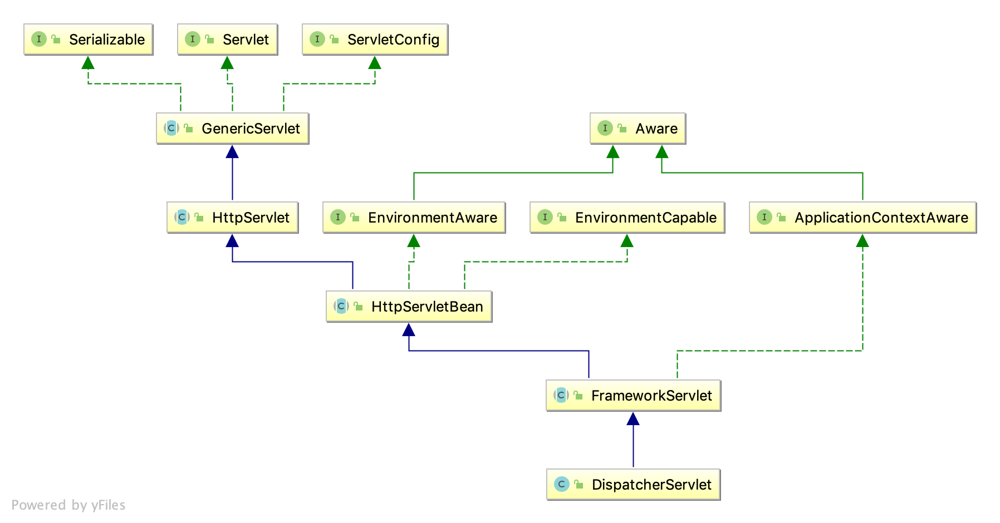</div><br>

    - ### ContextLoaderListener 初始化
        由于web.xml中配置了listener,tomcat启动时，会监听web容器的一些事件，例如创建session等
        ``` java
        public class ContextLoaderListener extends ContextLoader implements ServletContextListener {
            ....
            // 初始化web容器的根上下文
            @Override
            public void contextInitialized(ServletContextEvent event) {
                initWebApplicationContext(event.getServletContext());
            }

            // 关闭web容器的根上下文
            @Override
            public void contextDestroyed(ServletContextEvent event) {
                closeWebApplicationContext(event.getServletContext());
                ContextCleanupListener.cleanupAttributes(event.getServletContext());
            }
        }
        ```
        基本流程如下图：
        <div align="center">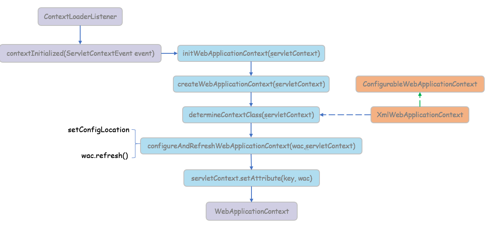</div><br>
        ContextLoaderListener实现了ServletContextListener，会监听ServletContext的整个生命周期，从创建到销毁。

        ContextLoaderListener读取在contextConfigLocation中定义的xml文件，自动装配ApplicationContext的配置信息，并产生WebApplicationContext对象，然后将这个对象放置在ServletContext的属性里，这样我们只要得到Servlet就可以得到WebApplicationContext对象

        其中determineContextClass方法会先获取web.xml中上下文参数contextClass，如果没有，则使用默认的XmlWebApplicationContext
        ``` java
        protected Class<?> determineContextClass(ServletContext servletContext) {
            String contextClassName = servletContext.getInitParameter(CONTEXT_CLASS_PARAM);
            if (contextClassName != null) {
                return ClassUtils.forName(contextClassName, ClassUtils.getDefaultClassLoader())
            }
            else {
                contextClassName = defaultStrategies.getProperty(WebApplicationContext.class.getName());
                return ClassUtils.forName(contextClassName, ContextLoader.class.getClassLoader());
            }
        }
        ```
        默认的contextClass存放在ContextLoader.properties配置文件中
        ``` properties
        # Default WebApplicationContext implementation class for ContextLoader.
        org.springframework.web.context.WebApplicationContext=org.springframework.web.context.support.XmlWebApplicationContext
        ```
    - ### DispatcherServlet初始化
         DispatcherServlet初始化大致如下：
         <div align="center">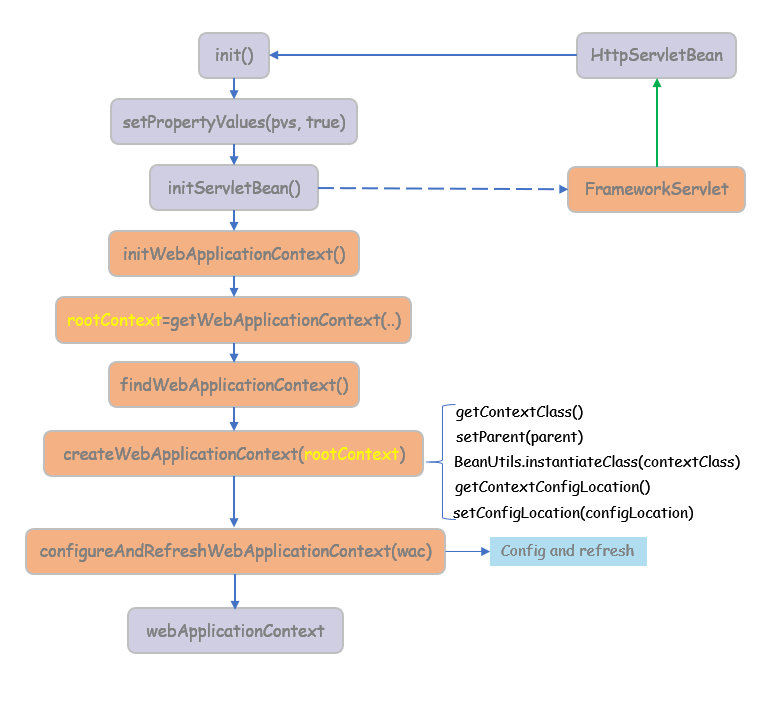</div><br>

    - ### 如何找到正确的Controller  
        * MvcNamespaceHandler
        * AnnotationDrivenBeanDefinitionParser
        * RequestMappingHandlerMapping

        <div align="center">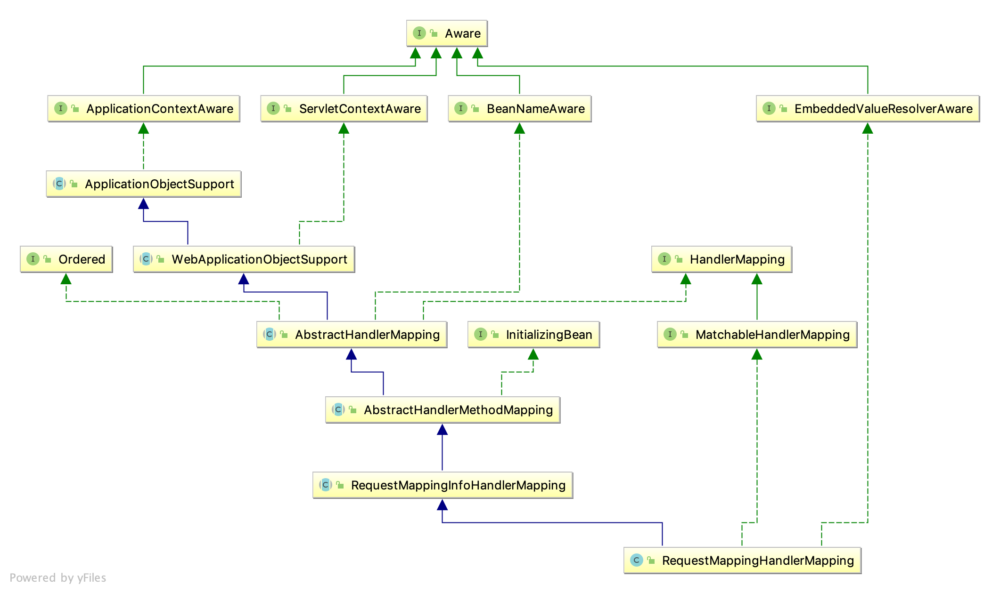</div><br>


# 四、Spring boot
- ## spring boot 自动装配
    - 定义: 基于约定大于配置的原则，实现spring组件自动装配的目的 
    - 装配：
        - 模式注解
        - @Enable模块
        - 条件装配
        - 工厂加载机制
            * 实现类：SpringFactoriesLoader
            * 配置资源：META-INF/spring.factories
    - 实现：
      - 激活自动装配 **@EnableAutoConfiguration**
      - 实现自动装配 **XXXAutoConfiguration**
      - 配置自动装配实现  **META-INF/spring.factories**

- ## SpringApplication
    
# 五、Srping Cloud
# 六、Spring事务