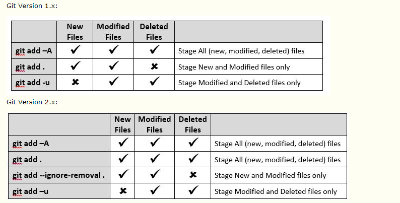

# git的使用指南
## git安装
- `Msysgit:`https://git-scm.com/download/win
- 配置用户信息
  - git config --global user.name "`Yourname`"
  - git config --global user.email "`Yourname`@163.com"
- SourceTree 下载
- 常用命令
  - git init
  - git add 文件
  - git commit -m "说明"
  - git status
  - 回滚 git reset HEAD ***.txt 
  - 单个删除文件：git rm test.txt、git commit -m "remove test.txt"
  - 批量操作命令
  
  > 参考网址：https://www.cnblogs.com/aimqqroad-13/p/7456296.html
## git工作流
工作区 -> 暂存区 -> 版本库

## 本地与远程仓库
`创建SSH KEY:`
ssh-keygen -t rsa -C "`Yourname`@163.com"

生成id_rsa、id_rsa.pub、known_hosts

`测试连通:`
ssh -T git@github.com

## 添加远程仓库
### push方式
* git remote add origin git@github.com:`Yourname`/programmer-notes.git
* git push -u origin master
* git pull origin master --allow-unrelated-histories

### colone方式
* git clone https://github.com/`Yourname`/programmer-notes.git
* git add
* git commit
* git push

## 分支管理
- git branch feature_x
- git branch 
- git checkout feature_x
- git merge feature_x
- git breanch -d feature_x

## 标签管理

可以通过标签管理，回滚

- git tag 
- git tag v1.0.1
- git push origin v1.0.1
- git tag -a name -m "comment"
- git tag -d name
