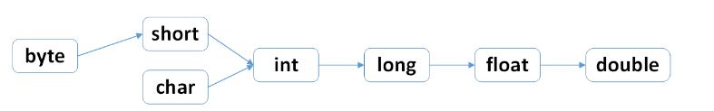
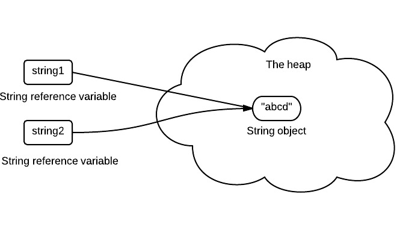

# Java基础知识

# 一、数据类型
- ### java标识符
  用于给java程序中的变量、类、方法等命名的符号。

  * 遵循以下规则
    * 标识符可以由字母、数字、下划线（_）、美元符（$）组成，但不能包含 @、%、空格等其它特殊字符，不能以数字开头。譬如：123name 就是不合法滴
    * 标识符不能是 Java 关键字和保留字（ Java 预留的关键字，以后的升级版本中有可能作为关键字），但可以包含关键字和保留字。如：不可以使用 void 作为标识符， 但是 Myvoid 可以
    * 标识符是严格区分大小写的。 所以涅，一定要分清楚 imooc 和 IMooc 是两个不同的标识符哦！
    *  标识符的命名最好能反映出其作用，做到见名知意。

- ### 包装类型

    八个基本类型:
    - boolean/1
    - byte/8
    - char/16
    - short/16
    - int/32
    - float/32
    - double/64
    - long/64

    * 数值型：byte|1  short|2  int|4  long|8  float|4  double|8
    * 字符型 char|2 
    * 布尔型 boolean|1 `理论上占1bit，1/8字节，实际处理按1byte处理`
  * 引用数据类型 类(class) 接口(interface) 数组

java 自动类型转换  强制类型转换(大-->小)

[](https://www.cnblogs.com/ljdblog/p/6253799.html "跳转说明")


    每个基本类型都有对应的包装类型，基本类型和其对应的包装类型的赋值使用自动装箱和拆箱完成

    ``` java
    Integer x = 2; //装箱
    int y = x;     //拆箱
    ```

  
    

    ## java常用的3种循环

```java
while(判断条件){
    循环操作
}
```

```java
do{
    循环操作
}while(判断条件);
```

```java
for(循环变量初始条件;循环条件;循环变量变化){
    循环操作
}
```
还有`foreach`等遍历操作

`break` 结束循环

`continue` 的作用是跳过循环体中剩余的语句执行下一次循环。

- ### 运算符的优先级


- ### 缓存池

    **new Integer(arg)** 和 **Integer.valueOf(arg)** 的区别:
    - **new Integer(arg)** 每次都会创建新的对象
    - **Integer.valueOf(arg)** 会使用缓存池中的对象,多次调用会取得同一个对象的引用

    Integer缓存池的大小默认为-128~127
    ``` java
    Integer a = new Integer(123);
    Integer b = new Integer(123);
    System.out.println(a == b); // false

    Integer x = Integer.valueOf(123);
    Integer y = Integer.valueOf(123);
    System.out.println(x == y); // true

    // Integer缓存池的大小默认为-128~127
    Integer j = Integer.valueOf(256);
    Integer k = Integer.valueOf(245);
    System.out.println(j == k); //false
    ```
    基本类型对应的缓存池：
    - boolean : false,true
    - all byte values
    - short : -128~127          
    - int : -128~127
    - char : \u0000~\u007F

- ### String
    String被声明为final，不能被继承
    
    java8中，String内部使用char数组存储数据

    ``` java
    /** The value is used for character storage. */
    private final char value[];
    ```
    value数组被声明为final，意味着数组被初始化后没有办法引用其他的数组，并且String内部没有提供改变value数组的方法，因此保证了String不可变。

    #### 不可变的好处：
    - 可以缓存hash值

        不可变的特性使得hash值也不可变因此只需计算一次hash值即可

    - String Pool的需要

        如果一个对象已经被创建过，那么就会从String Pool中取得引用。只有String是不可变的，才能使用String Pool.

        <div align="center"></div><br>

    - 安全性

        String作为参数，其不可变性可以保证参数不可变

    - 线程安全

        String的不可变性天生具备线程安全，可以在多个线程中安全地使用

    #### String，StringBuffer，StringBuilder
    - 不可变性
        - String不可变
        - StringBuffer,StringBuilder可变
    - 线程安全
        - String不可变，所以是线程安全的
        - StringBuilder不是线程安全的
        - StringBuffer每部使用synchronize

    #### String Pool
    字符串常量池(String Pool)保存着所有字符串字面量，这些字面量在编译时期就确定，可以通过String的intern方法在运行过程中将字符串添加到String Pool中。

    当使用intern方法，如果String Pool中已经存在一个字符串和改字符串相等(通过equals方法判断)，就会返回String Pool中字符串的引用；否则会在String Pool中添加一个新的字符串，并返回改字符串的引用

    ``` java
    String a = new String("abc");
    String b = new String("abc");
    System.out.println(a == b); //false
    System.out.println(a.equals(b)); //true
    System.out.println(a.intern() == b.intern()); //true

    String x = "abc";
    String y = "abc";
    System.out.println(x == y); //ture
    System.out.println(a == x); // false
    System.out.println(a.intern() == x); //true
    System.out.println(x.equals(y)); //true
    System.out.println(x.equals(a)); // true
    ```

    在Java7之前，String Pool存放在运行时常量池，属于**永久代**，在Java7中，String Pool被移动到堆中。这是因为**永久代**的空间有限，在大量使用字符串的场景中会导致OutOfMemoryError错误。

    **new String("abc")**

    使用这种方式会创建两个字符串对象(前提是String Pool中没有“abc”字符串对象)。
    - "abc"属于字符串常量，在编译时期会在String Pool中创建一个字符串对象，指向这个字符串常量

    - 使用new方式会在堆中创建一个字符串对象

# 二、运算
- ### 参数传递
    **Java的参数是以值传递的形式传入到方法中，而不是引用传递**

- ### float和double
    **Java不能隐式执行向下转型，因为这会使精度降低**

    **1.1**字面量属于double类型，不能将其直接赋值给float,因为这是向下转型
    ``` java
    // float f1 = 1.1; ERROR
    // Float f2 = 1.1; ERROR
    float f1 = 1.1f;
    Float f2 = 1.1f;
        
    double d1 = 1.1;
    Double d2 = 1.1;
    ```
- ### 隐式类型转化
    字面量**1**是**int**型，比short类型的精度要高，因此不能隐式地将int类型向下转化为short类型

    ``` java
    short s1 = 1;
    // s1 = s1 + 1 ERROR
    ```

    但是使用 += 或者 ++ 运算符可以执行隐式类型转换。
    ``` java
    short s1 = 1;
    s1 += 1;
    s1++;
    ```
    上面的语句相当于将 s1 + 1 的计算结果进行了向下转型：
    ``` java
    s1 = (short) (s1 + 1);
    ```
- ### switch
    从 Java 7 开始，可以在 switch 条件判断语句中使用 String 对象。

    switch 不支持 long，是因为 switch 的设计初衷是对那些只有少数的几个值进行等值判断，如果值过于复杂，那么还是用 if 比较合适。

# 三、面向对象
- ### 访问权限
    **public default protected private**

- ### 抽象类和借口
    - #### 抽象类和抽象方法
        使用关键字abstract进行声明，抽象类一般包含抽象方法，抽象方法一定位于位抽象类中。

        抽象类不能被实例化，需要继承抽象类才能实例化其子类

    - ### 接口
        接口中的方法和字段只能时public的

        接口中的字段默认是static和final的

        java8之前接口不能有任何的方法事项，java8接口可以用默认的方法实现

- ### super
    - #### 访问父类的构造函数：可以使用super访问父类的构造函数，从而委托父类完成一些初始化工作

    - #### 访问父类的成员：如果子类重写了父类的方法，可以使用super来引用父类的实现

- ### 重写与重载
    - #### 重写(Override) @override
    - #### 重载(Overload)

# 四、Object通用方法
``` java
public native int hashCode()

public boolean equals(Object obj)

protected native Object clone() throws CloneNotSupportedException

public String toString()

public final native Class<?> getClass()

protected void finalize() throws Throwable {}

public final native void notify()

public final native void notifyAll()

public final native void wait(long timeout) throws InterruptedException

public final void wait(long timeout, int nanos) throws InterruptedException

public final void wait() throws InterruptedException
```
- ### equals方法
    - #### 等价关系
        1、自反性
        ``` java
        x.equals(x) //true
        ```
        2、对称性
        ``` java
        x.equals(y) == y.equals(x) //true
        ```
        3、传递性
        ``` java
        if(x.equals(y) && y.equals(z)){
            x.equals(z) //true
        }
        ```
        4、一致性
        
        多次调用equals方法结果不变
        
        5、与null相比较

        任何对象和null相比较返回都是false

    - #### 等价与相等
        equals判断等价，==判断相等

    - #### 实现
        - 检查是否为同一个对象的引用，如果是直接返回true
        - 检查是否是同一类型，如果不是直接返回false
        - 将Object对象进行转型
        - 判断每个关键字段是否相等
        ``` java
        public class Person{

            private String id;
            private String name;

            public class Person(String id, String name){
                this.id = id;
                this.name = name;
            }

            @Override
            public boolean equals(Object object){
                // 检查是否为同一个对象的引用
                if(this == object) return true;
                // 检查是否是同一类型
                if(object == null || getClass() != object.getClass()){
                    return false
                } 
                // 将Object对象进行转型
                Person person = (Person)object;
                // 判断每个关键字段是否相等
                if(id.equals(person.id)) return false;
                return name.equals(person.name);
            }
        }
        ```
- ### hashCode()
    hashCode返回散列值，用equals方法判断两个是否等价，等价的两个对象的hashCode一定是相等的，但是hashCode相等的两个对象不一定等价

    重写equals方法，一定要重写hashCode方法，保证等价的两个对象的散列值一定相等。

    理想的散列函数应当具有均匀性，即不相等的对象应当均匀分布到所有可能的散列值上。这就要求了散列函数要把所有域的值都考虑进来。可以将每个域都当成 R 进制的某一位，然后组成一个 R 进制的整数。R 一般取 31，因为它是一个奇素数，如果是偶数的话，当出现乘法溢出，信息就会丢失，因为与 2 相乘相当于向左移一位。

    一个数与 31 相乘可以转换成移位和减法：31*x == (x<<5)-x，编译器会自动进行这个优化。

    ``` java
    @Override
    public int hashCode() {
        int result = 17;
        result = 31 * result + x;
        result = 31 * result + y;
        result = 31 * result + z;
        return result;
    }
    ```
- ### toString()
- ### clone()
    - #### cloneable
        clone()是Object的protected方法，他不是public，一个类不显式地去重写clone(),就不能直接调用该类实例的clone()方法。

        ```java
        public class CloneExample{
            private int x;
            private int y;
        }

        CloneExample o1 = new CloneExample();
        //o1.clone(); 'clone()' has protected access in 'java.lang.Object'
        ```

        重写clone()方法
        ``` java
        public class CloneExample{
            private int x;
            private int y;

            @Override
            public CloneExample clone() throws CloneNotSupportedException{
                return (CloneExample)super.clone();
            }

        }

        CloneExample o1 = new CloneExample();
        try{
            o1.clone();
        }
        catch(CloneNotSupportedException e){
            e.printStackTrace();
        }

        java.lang.CloneNotSupportedException : CloneExample
        ```

        虽然重写了clone方法，但是还是会抛出CloneNotSupportedException的异常，这是因为CloneExample没有实现Cloneable接口。

        clone()方法并不是Cloneable接口的方法，而是Object的一个protected方法，Cloneable接口只是规定，如果一个类没有实现Cloneable接口，却又调用了clone()方法，就会跑出CloneNotSupportException的异常

    - ### 浅拷贝
        拷贝对象和原始对象的引用类型引用同一个对象，改变原始对象的值，拷贝对象的值也会受影响

    - ### 深拷贝
        拷贝对象和原始对象的引用类型引用不同的对象，改变原始对象的值，不会对拷贝对象的值

    - ### clone()替代方案
        使用 clone() 方法来拷贝一个对象即复杂又有风险，它会抛出异常，并且还需要类型转换。Effective Java 书上讲到，最好不要去使用 clone()，可以使用拷贝构造函数或者拷贝工厂来拷贝一个对象。

# 五、关键字
- ### final
    - #### 数据

        声明数据为常量，可以使编译时的常量，也可以是在运行时被初始化后不能改变的常量(类中的字段被声明为常量，必须在构造函数进行初始化)

        - 对于基本类型，final使数值不变

        - 对于引用类型，final使引用不变，也就意味着不能引用其他的对象，但是被引用的对象本身是可以修改的

        ``` java
        final int x = 1;
        // x = 1; ERROR;
        fina A a = new A();
        // a = new B();ERROR
        a.attr1 = 1;
        ```  
    
    - #### 方法

        声明的方法不能被子类重写

    - #### 类

        声明的类不能被继承

- ### static
    - #### 静态变量
        静态变量又被称为类变量，变量属于类，所有类的实例共享，可以直接通过类名访问，其在内存中只存在一份。
    
    - #### 静态方法
        静态方法在类加载时就已经存在你，不以来任何实例，所以静态方法必须有所实现，也就是它不能是抽象方法

        只能访问所属类的静态字段和静态方法，所以方法中不能又this和super关键字

    - #### 静态语句块
        静态语句块尽在类加载时初始化一次

    - #### 静态内部类
        非静态内部类依赖于外部类的实例，静态内部类不需要

    - #### 静态导包
        使用静态变量和静态方法时不用再指明类，简化代码，降低代码可读性

    - #### 初始化顺寻
        - 父类（静态变量、静态语句块）
        - 子类（静态变量、静态语句块）
        - 父类（实例变量、普通语句块）
        - 父类（构造函数）
        - 子类（实例变量、普通语句块）
        - 子类（构造函数） 

# 六、反射
# 七、异常

- ### Throwable 
    可以用来表示任何可以作为异常抛出的类，分为两种

    1、Error 用来表示 JVM 无法处理的错误

    2、Exception

- ### Exception
    - 受检异常 ：需要用 try...catch... 语句捕获并进行处理，并且可以从异常中恢复
    - 非受检异常 ：是程序运行时错误，例如除 0 会引发 Arithmetic Exception，此时程序崩溃并且无法恢复

<div align="center"></div><br>

# 八、泛型
# 九、注解
# 十、其他


