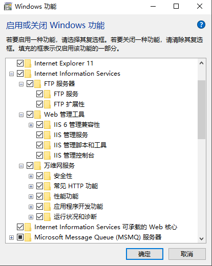
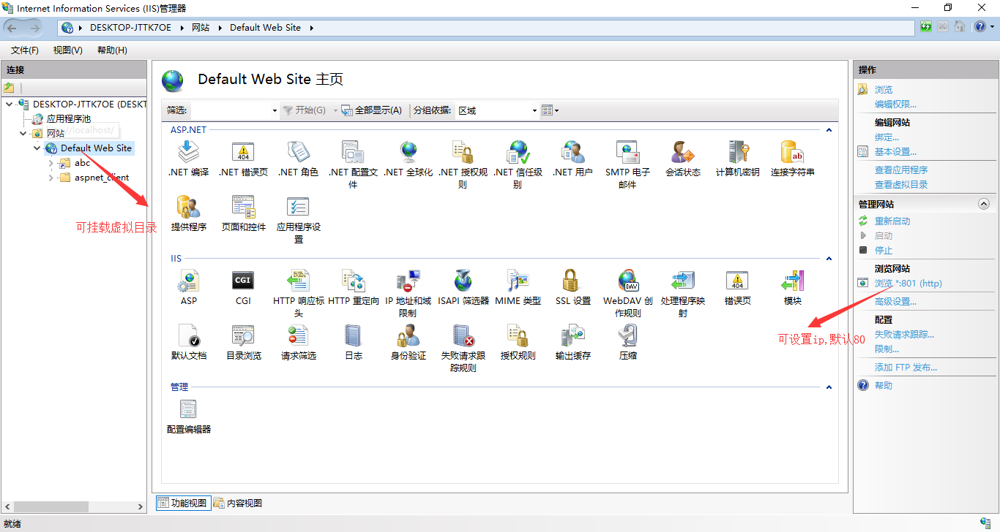

# Markdown使用指南
## 概要

Markdown是一种可以使用普通文本编辑器编写的标记语言，通过简单的标记语法，它可以使普通文本内容具有HTML的格式。

## 官方网站

https://daringfireball.net/projects/markdown/

## 预览工具

* 使用Chrome插件，安装插件网址<https://chrome.google.com/webstore/category/extensions>
* Chrome + Markdown Anywhere


## vscode安装
[vsvscode下载网址](https://code.visualstudio.com/Download "点击跳转")

 ### 常用使用技巧
 `Ctrl + Shift + P` 调出主命令框，输入 Markdown，应该会匹配到几项 Markdown相关命令
选择Markdown: Open Preview to the Side，就能调出实时预览框了。

先按`Ctrl + K`，然后放掉，紧接着再按 v，也能调出实时预览框。

`Ctrl + Shift + v` 调出预览，新窗口

安装`Markdown PDF`插件，可导出pdf格式的文件，使用方便


## 本地WebServer服务开启


IIS使用中可能出现端口被占用的情况导致无法启动，检查端口  
并且需要设置万维网服务启动



## markdowm 基本语法

# 一级标题
## 二级标题
### 三级标题
#### 四级标题
##### 五级标题
###### 六级标题

h1标题
===

h2标题
---

### 与h2的区别

`列表`
- 主页
- 新闻
  - 体育
  - 军事
  - 娱乐
- 读书

* 读新闻
* 经典课程
  * vue入门
  * vue进阶
  * node.js教学
* 经典游戏

`加粗文本` **笔记基础语法**, __笔记基础语法__

`斜体` *笔记基础语法*

`下划线` <u>笔记基础语法</u>

`删除线` ~~这是删除线~~

`引用文本`
> 近日，印象笔记宣布完成重组。作为Evernote已在中国独立运营近6年的品牌，印象笔记将成为由中方控股的中美合资独立运营实体，并获得红杉宽带跨境数字产业基金首轮数亿元人民币投资

`添加符号列表或者数字列表`

使用 iOS 版本印象笔记如何快速保存内容？
1. 启用印象笔记 Widget ——印象笔记·剪贴板
0. 复制粘贴任意内容
     * 微信
0. 滑动到 Widget 插件区域即可完成保存
印象笔记·剪贴板有什么特点？
* 快：开启自动模式，可以自动保存剪贴板的任意内容
* 一切：只要可以复制粘贴就可以保存
* 有序：全部保存在「我的剪贴板」笔记本并以时间来命名

``添加超链接``

`高亮`
~~~
东南西北东南西北东南西北东南西北东南西北东南西北东南西北东南西北东南西北东南西北东南西北东南西北东南西北东南西北东南西北东南西北东南西北东南西北东南西北东南西北东南西北东南西北

中发白中发白中发白中发白中发白中发白中发白中发白中发白中发白中发白中发白中发白中发白中发白中发白中发白中发白中发白中发白中发白中发白中发白中发白中发白中发白中发白中发白中发白中发白

万筒条万筒条万筒条万筒条万筒条万筒条万筒条万筒条万筒条万筒条万筒条万筒条万筒条万筒条万筒条万筒条万筒条万筒条万筒条万筒条万筒条万筒条万筒条万筒条万筒条万筒条万筒条万筒条万筒条万筒条

东南西北中发白万筒条
~~~


分割线1
***

分割线2
___

分割线3
- - -

`插入链接`[印象笔记官网](https://www.yinxiang.com/)


## `表格`
| 帐户类型 | 免费帐户 | 标准帐户 | 高级帐户 |
| --- | --- | --- | --- |
| 帐户流量 | 60M | 1GB | 10GB |
| 设备数目 | 2台 | 无限制 | 无限制 |
| 当前价格 | 免费 | ￥8.17/月 | ￥12.33/月|


`代码块写法`
(```)
    function fun(){  
         echo "这是一句非常牛逼的代码";  
    }
    fun();
(```)


```javascript
function add(x, y) {
    return x+y;
}
```


```java
public static void main(String[] args){
   Sysout.out.print("这是jiava代码块");
}
```

* `图片的引用与显示：`
## 说明 
[](https://baike.baidu.com/item/github/10145341?fr=aladdin)


# `备注说明`
针对不同`浏览器或者工具`，显示的效果不同，并且很多工具带有扩展功能，例如：[印象笔记](https://www.yinxiang.com/ "点击跳转印象官网"),印象markdown语法参考网址-https://list.yinxiang.com/markdown/eef42447-db3f-48ee-827b-1bb34c03eb83.php  

参考链接 http://wow.kuapp.com/markdown/#autolink


