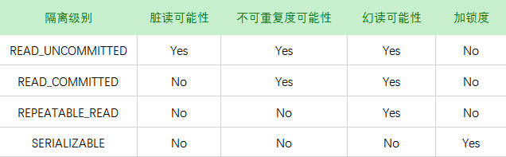

# 一、概览

- 数据库表设计的三大范式

    * 1NF 属性的原子性，属性具有原子性，不可再分解
    * 2NF 记录的唯一性，要求记录具有唯一性标识，即实体的唯一性，即不存在部分依赖

        ```
        表：学号、课程号、姓名、学分;
        ```

        这个表明显说明了两个事务:学生信息, 课程信息;由于非主键字段必须依赖主键，这里学分依赖课程号，姓名依赖与学号，所以不符合二范式。

        可能存在的问题

        - 数据冗余:，每条记录都含有相同信息；
        - 删除异常：删除所有学生成绩，就把课程信息全删除了；
        - 插入异常：学生未选课，无法记录进数据库；
        - 更新异常：调整课程学分，所有行都调整。

        正确做法: 
        - 学生：Student(学号, 姓名)； 
        - 课程：Course(课程号, 学分)； 
        - 选课关系：StudentCourse(学号, 课程号, 成绩)

    * 3NF 字段的冗余性，要求任何字段不能有其他字段派生出来，它要求字段没有冗余，即不存在依赖传递

        ```
        表: 学号, 姓名, 年龄, 学院名称, 学院电话
        ```

        因为存在依赖传递: (学号) → (学生)→(所在学院) → (学院电话)

        可能会存在问题：

        - 数据冗余:有重复值；
        - 更新异常：有重复的冗余信息，修改时需要同时修改多条记录，否则会出现数据不一致的情况 。

        正确做法：

        - 学生：(学号, 姓名, 年龄, 所在学院)；
        - 学院：(学院, 电话)。

# 二、并发控制

- 读写锁
    
    这两中类型的锁通常被称为**共享锁和排他锁**、**读锁和写锁**。

    读锁是共享的，互不阻塞的，多个客户端在同一时刻读取同一个资源，是互不干扰的；

    写锁是排他的，也就是说一个写锁会阻塞其他的写锁和读锁

- 锁粒度

    - **表锁**

        表锁是MySQL中最基本的锁策略，并且是开销最小的锁，它会锁定整张表，一个用户对表的插入、更新、删除操作，需要先获取写锁，这会阻塞其他用户对该表的读写操作，只有没有写锁时，其他用户才能获取读锁，读锁之间是相互不阻塞的

    - **行级锁**

        行级锁可以最大程度地支持并发处理，但是同时也会带来最大的锁开销

# 三、事务

- 四大特性

    - **原子性(Atomicity)**

        一个事务必须被视为一个不可分割的最小工作单元，整个事务中的所有操作要么全部成功，要么全部失败回滚。

    - **一致性(Consistency)**

        数据库总是从一个一致性的状态转化到另一个一致性的状态。

    - **隔离性(Isolation)**

        一个事务所做的修改在最终提交之前，对其他事务是不可见的。

    - **持久性(Durability)**

        一旦事务提交，则其所做的修改就会永远保存到数据库中，此时即便是系统崩溃，修改的数据也会丢失。

- 隔离级别

    - **READ_UNCOMMITTED (未提交读)** 
    
        事务可以读取到未提交的数据，这也被称为**脏读**

    - **READ_COMMITTED (提交读)**

        一个事务从开始直到提交之前，所做的任何操作修改对于其他的事务都是不可见的，也被称为不可重复度，因为两次执行同样的查询，可能得到不一样的结果。

        大多数数据库的默认隔离级别就是READ_COMMITTED(MySQL不是)，满足四大特性中的隔离性

    - **REPEATABLE_READ (可重复读)**

        REPEATABLE_READ解决了脏读的问题，该级别保证了同一事物中多次读取同样记录的结果是一样的。

        REPEATABLE_READ但是无法解决幻读，所谓的幻读就是某个事务在读物某个范围内的记录时，另一个事务又在该范围内插入了新的记录，当之前的事务再次读取该范围内的记录时，产生了幻行。

        可重复度是MySQL的默认事务级别

    - **SERIALIZABLE (可串行化)**

        SERIALIZABLE是最高的隔离级别，通过强制事务串行执行，避免了前面所说的幻读的问题，它会在读取的每一行数据上都加锁，所以可能导致大量的超时和锁争用的问题，实际应用上很少用到这个隔离级别

        <div align="center"></div><br>

# 三、数据类型及优化

- 数据类型选择的几个通用原则

    - **更小的通常更好**

        一般情况下，应该尽量使用可以正确存储数据的最小数据类型，更小的数据类型通常更快，因为他们占用更少的磁盘、内存和CPU缓存，并且处理时所需要的CPU周期也更少

    - **简单就好**

        简单数据类型的操作通常需要更少的CPU周期，例如整型比字符串操作代价更低

    - **尽量避免NULL**

        NULL的列使得索引、索引统计和值比较都更复杂。可为NULL的列会使用更多的空间，在MySQL中也需要特殊地处理，当可为NULL的列被索引时，每个索引记录需要一个额外的字节

- 整数类型
  
    - **TINYINT** 8
    - **SMALLINT** 16
    - **MEDIUMINT** 24
    - **INT** 32
    - **BIGINT** 64
    
    存储的值的范围从-2^(N-1)到2^(N-1)-1，其中N为存储空间的位数

    整数类型有可选的UNSIGNED属性，表示不允许负值，这大致上可以是整数的上限提高一倍

    有符号和无符号类型使用相同的存储空间，并且具有相同的性能，因此可以根据实际情况选择合适的类型

- 实数类型

    实数是带有小数部分的数字，它不仅为了储存小数部分，也可以使用**DECIMAL**存储比**BIGINT**还大的整数；MySQL即支持精确类型，也支持不精确类型

    **FLOAT**和**DOUBLE**类型支持使用标准的浮点运算进行近似运算。

    **DECIMAL**类型用于储存精确的小数，支持精确计算

- 字符串类型

    - **VARCHAR**

        VARCHAR类型用于存储可变字符串，是最常见的字符串类型，它比定长类型更节省空间，因为它仅使用必要的空间

        VARCHAR需要使用1或2个字节记录字符串的长度，如果列的最大长度小于等于255，则使用1个，否则使用2个

    - **CHAR**

        CHAE类型是定长的，不易产生碎片

    - **BINARY和VARBINARY**

        他们存储的是二进制字符串，大小写敏感，比较是速度更快

- 日期和时间类型

    - **DATETIME**

        从1001到9999年，精度为妙，占用8个字节，与时区无关

    - **TIMESTAMP**

        从1970到2038，占用4个字节，显示的值依赖于时区

# 四、索引

- 索引的类型

    * B-Tree索引

        使用B-Tree数据结构来存储数据，所有的值都是按照顺序进行存储的，并且每一个叶子页到根的距离都是相等的

        ```sql
        CREATE TABLE PEOPLE(
            LAST_NAME VARCHAR(50) NOT NULL,
            FIRST_NAME VARCHAR(50) NOT NULL,
            DOB DATE NOT NULL,
            GENDER ENUM('M', 'F') NOT NULL,
            KEY(LAST_NAME, FIRST_NAME, DOB)
        )
        ```

        B-Tree索引适用于全键值、键值范围或键前缀查找，其中键前缀查找只适用于最左前缀查找，对一下查找类型有效：

        * 全值匹配

            全值匹配指的是与索引中的所有的列进行匹配，前面的索引可用于查找姓为Cuba，名为Allen，出生在1960-01-01的人

        * 匹配最左前缀

            前面的索引可用于查找姓为Allen的人，只用到了索引的第一列

        * 匹配列前缀

            只匹配索引某一列值的开头部分，例如前面的索引可以用来查找以J开头的姓，这里只使用了索引的第一列

        * 匹配范围值

            例如前面的索引可以查找姓位于Allen和Barrymore之间的人，只用到了索引的第一列

        * 精确匹配某一列并范围匹配另一列

            前面的索引可以用来查找姓为Allen，名字以K开头的人，即第一列全匹配，第二列范围匹配

        * 只访问索引的查询

            B-Tree通常支持只访问索引的查询，即查询只访问索引，而无需访问数据行

        因为索引中的节点是有顺序的，所以除了按值查找之外，索引也可以用于查询中的order by操作，一般来说，如果B-Tree可以按照某种方式查找到值，那么也可以按照这种方式用于排序，所以如果order by子句中满足前面列出的几种查询类型，那么这个索引也可以满足对应的排序要求

        B-Tree索引的限制

        * 如果不是按照索引的最左列查找，则无法使用索引

            例如上面的索引无法用于查找名为Barraymore的人，也无法查找某个特定生日的人，因为这两列都不是最左索引。

        * 不能跳过索引列

            例如前面的索引无法查找姓为Allen并且在某个特定时间出生的人，因为索引无法跳过某一列(名字)

        * 查询中有某一列的范围查询，则在其右边的列无法使用索引优化查找

            例如下面的查询语句
            ``` sql
            select last_name,first_name,dob from people where last_name = 'Allen' and first_name like 'B%' and dob = '1979-01-01'; 
            ```
            这个查询只能用到索引的前两列，因为first_name是个范围查询

    * 哈希索引

        哈希索引基于哈希表实现，对于每一行的数据存储引擎会对所有的索引列计算一个hash code，哈希索引将所有的hash code存储在索引中，同时在哈希表中保存指向每一行的指针。

        ``` sql
        CREATE TABLE TESTHASH(
            FNAME VARCHAR(50) NOT NULL,
            LNAME VARCHAR(50) NOT NULL,
            KEY USING HASH(FNAME)
        ) ENGINE = MEMORY
        ```
        哈希索引的限制：

        * 哈希索引中只能保存哈希值和指针，而不存储字段，所以使用哈希索引不能避免查找行
        * 哈希索引并不是按照索引值的顺序来存储的，所以无法用于排序
        * 哈希索引也不支持部分索引列匹配查找，因为哈希索引始终使用索引的全部内容来计算哈希值，例如在数据列(A,B)上建立哈希索引，如果查询只使用了A，则无法使用该索引
        * 哈希索引只支持等值比较，包括=，in()，<=>；不支持任何范围查找，例如where price > 10
        * 访问哈希索引非常快，除非有哈希冲突，当出现哈希冲突时，存储引擎必须遍历链表中所有的行指针，逐行进行比较，直到找到所有符合条件的行
        * 如果哈希冲突很多的话，一些索引维护操作的代价会很高，例如如果在某个选择性比较低的列上建立了哈希索引，那么当从表中删除一行时，存储引擎会遍历哈希值的链表中的每一行，找到并删除对应的行，冲突越多，代价越大

    * 空间数据索引

    * 全文索引

        全文索引是一种特殊的索引，它查找的是文本中的关键字，而不是直接比较索引中的值。

- 索引的优点

    * 索引大大减少了服务器所需要扫描的数据量
    * 索引可以帮助服务器避免排序和临时表
    * 索引将随机IO变为顺序IO

    如何评价一个索引是否适合某个查询的“三星系统”(three-star system):

    * 索引将相关的记录放到一起则获得一星
    * 如果索引中的数据顺序和查询中的排序顺序一致则获得二星
    * 如果索引中的列包含了查询中需要的全部列则获得三星

- 高性能的索引策略

    * 独立的列

        独立的列指的是索引列不能是表达式的一部分，也不能是函数的参数

        例如下面这个查询无法使用actor_id列的索引
        ``` sql
        SELECT ACTOR_ID FROM SAKILA.ACTOR WHERE ACTOR_ID + 1 = 5;
        ```
    * 前缀索引和索引的选择性

        当需要索引很长的字符串时，会让索引变得大且慢，通常我们可以索引开始部分的字符串，这样可以大大节省索引的空间，从而提高索引的效率，但是这样会降低索引的选择性。

        索引的选择性是指不重复的索引值和数据表的记录总数(#T)的比值，范围从1/#T到1之间。

        索引的选择性越高则查询效率越高，因为选择性高的索引可以让MySQL在查找时过滤掉更多的行，唯一索引的选择性为1，这是最好的索引选择性，性能也是最好的。

        要选择足够长的前缀以保证较高的选择性，同时又不能太长来节约空间

        ``` sql
        ALTER TABLE EMPLOYEE ADD KEY(FIRSTNAME(5))
        ```

    * 多列索引

        在多个列上建立单独的单列索引大部分情况下不能提高MySQL的性能，MySQL5.0和新版本中引入了一种“索引合并”的策略，一定程度上可以使用表上的多个单列索引来定位指定的行。

        索引合并策略有时候是一种优化的结果，但实际上更多时候说明表上的索引建的很糟糕

    * 选择合适的索引顺序

        在一个多列B-Tree索引中，索引列的顺序意味着索引首先按照最左列进行排序，其次是第二列等等，索引可以按照升序或者降序进行扫描，以满足精确符合列顺序的ORDER BY,GROUP BY和DISTINCT等句子的查询

        当不需要考虑排序和分组时，将选择性最高的列放在最前面通常是很好的选择，然而性能不只是依赖于所有索引列的选择性，也和查询条件的具体值有关，也就是和值得分布有关