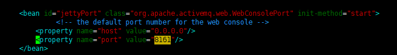

# 电子商城项目说明

# zookeeper安装
官网 https://www.apache.org/dyn/closer.cgi/zookeeper/

下载网址(备)http://mirrors.hust.edu.cn/apache/zookeeper/

安装参考 http://note.youdao.com/noteshare?id=e9d3f2eb943fee39c5785b89f878365d&sub=4BF02F1A15994547957E5CAE18C97FF3

# redis安装
## 单机安装
采用docker部署

(注意开放端口)
- docker pull redis
- docker run -d -p 6379:6379 redis

## 集群搭建
参考网址
- https://www.jb51.net/article/155396.htm
- https://www.cnblogs.com/wuxl360/p/5920330.html

# activeMQ相关部署
## 安装

- cd /usr/local/src/
- wget http://mirrors.shu.edu.cn/apache//activemq/5.15.9/apache-activemq-5.15.9-bin.tar.gz
- tar -xzvf apache-activemq-5.15.9-bin.tar.gz

- cd /usr/local/src/apache-activemq-5.15.9/bin/linux-x86-64/
- 启动activemq服务
  -  ./activemq start
- 关闭activemq服务
  - ./activemq stop
     - Stopping ActiveMQ Broker...
     - Stopped ActiveMQ Broker.

## 端口调整
- cd /usr/local/apache-activemq-5.15.9/conf
- vim activemq.xml

- vim jetty.xml

http://47.99.215.55:8161/admin/ 

admin 
admin

# solr安裝部署
## 前期准备
`查看端口占用情况`
- netstat -ano | grep 8110
- lsof -i:8110
- kill -9 pid

`部署tomcat`
## 安装部署
- cd /usr/local
- mkdir solr
- cp /usr/local/solr/solr-4.10.3/dist/solr-4.10.3.war /usr/local/solr/apache-tomcat-7.0.94/webapps/
- tail -f -n 500 catalina.out 
- cp /usr/local/solr/solr-4.10.3/example/lib/ext/* /usr/local/solr/apache-tomcat-7.0.94/webapps/solr-4.10.3/WEB-INF/lib/
- cp -r /usr/local/solr/solr-4.10.3/example/solr /usr/local/solr/solrhome
- 编辑web.xml

- 中文
  - cp IKAnalyzer2012FF_u1.jar /usr/local/solr/apache-tomcat-7.0.94/webapps/solr-4.10.3/WEB-INF/lib/
  - cp IKAnalyzer.cfg.xml ext_stopword.dic mydict.dic /usr/local/solr/apache-tomcat-7.0.94/webapps/solr-4.10.3/WEB-INF/classes
  - cd /usr/local/solr/solrhome/collection1/conf

- 部署网址 http://47.99.215.55:8110/solr-4.10.3

# dubbo-admin部署

- 部署网址 http://47.99.215.55:8130/dubbo-admin-2.5.9/

- 下载网址 https://github.com/apache/dubbo/
- docker pull tomcat:7.0.94
- docker run -d -p 8130:8080 tomcat:7.0.94
- docker cp dubbo-admin-2.5.9.war d58d827ff3d1:/usr/local/tomcat/webapps
  - 从主机复制到容器 sudo docker cp host_path containerID:container_path 
  - 从容器复制到主机 sudo docker cp containerID:container_path host_path

# FastDFS 分布式文件系统（部署和运维）

参考网址(或部署文档) https://blog.csdn.net/kamroselee/article/details/80334621

