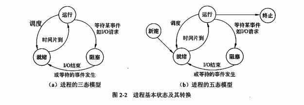

# 架构师备考
# 计算机与网络基础知识
## 操作系统基础知识

## 操作系统的特征
1. 并发性
0. 共享性
0. 虚拟性
0. 不确定性

## 操作系统的功能
1. 进程管理
0. 文件管理
0. 存储管理
0. 设备管理
0. 作业管理

## 处理机与进程
进程：资源分配和独立运行的基本单位。

程序和进程：程序是静态指令序列，进程为只从该程序的线程而保留的资源集。

## 进程模型

进程控制：对系统中所有进程从创建到消亡的全过程实施有效的控制。

## 进程的互斥与同步以及怕pv操作

## 进程调度与死锁
- 产生死锁条件
  - 互斥条件
  - 请求保持条件
  - 不可剥夺条件
  - 环路条件

## 线程
线程是进程中的一个实体，系统独立分配和调度的基本单元。

- 并行与并发
  - 并行指在同一时间点同时执行（进程可以并行）
  - 并发是指在同一时间片段同时执行(实际还是顺序执行)

## 存储管理
存储器结构
 - 寄存器-主存-外存
 - 寄存器-缓存-主存-外存

